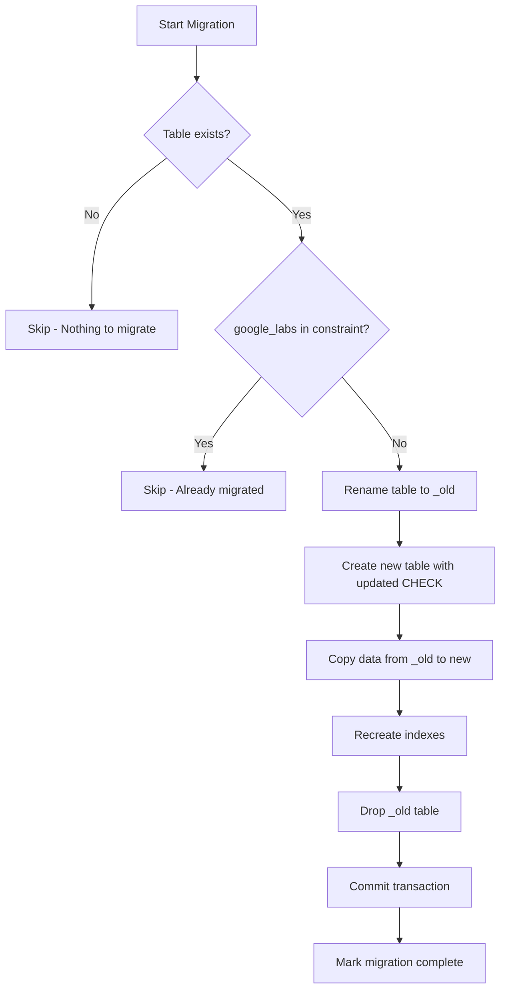

# Implementation Plan: Database Constraint Update for google_labs Platform

**Branch**: `db-constraint-update-google-labs` | **Date**: 2026-02-06 | **Spec**: [db_constraint_update_spec.md](.specify/db_constraint_update_spec.md)

## Summary

Add `'google_labs'` to the `account_management.platform` CHECK constraint using SQLite's "Recreate Table" migration strategy. This ensures backward compatibility for existing databases that may have older constraints.

## Technical Context

**Language/Version**: Python 3.11  
**Primary Dependencies**: sqlite3 (stdlib)  
**Storage**: SQLite database  
**Testing**: pytest  
**Target Platform**: Windows/Linux server  
**Project Type**: Single Python application  

## Files to Modify

| File | Change Type | Description |
|------|-------------|-------------|
| [`pyBot_modules/shared/db/migrations.py`](pyBot_modules/shared/db/migrations.py) | ADD | New migration function `migrate_account_management_add_google_labs_platform` |
| [`pyBot_modules/shared/db/schema.py`](pyBot_modules/shared/db/schema.py) | VERIFY | Confirm `'google_labs'` already in CHECK constraint (line 140) |

## Migration Strategy: Recreate Table

### Step-by-Step Process



### SQL Operations

```sql
-- Step 1: Rename old table
ALTER TABLE account_management RENAME TO account_management_old;

-- Step 2: Create new table with updated CHECK constraint
CREATE TABLE account_management (
    id TEXT PRIMARY KEY,
    platform TEXT NOT NULL CHECK(platform IN ('google_labs', 'sora', 'grok', 'facebook', 'tiktok', 'youtube', 'instagram')),
    -- ... all other columns same as schema.py
);

-- Step 3: Copy data
INSERT INTO account_management SELECT * FROM account_management_old;

-- Step 4: Recreate indexes
CREATE INDEX IF NOT EXISTS idx_account_management_platform ON account_management(platform);
CREATE INDEX IF NOT EXISTS idx_account_management_status ON account_management(status);
CREATE INDEX IF NOT EXISTS idx_account_management_profile_id ON account_management(profile_id);
CREATE INDEX IF NOT EXISTS idx_account_management_email ON account_management(email);

-- Step 5: Drop old table
DROP TABLE account_management_old;
```

## Risk Analysis

| Risk | Severity | Mitigation |
|------|----------|------------|
| **DB Lock if app running** | HIGH | Ensure app is stopped before migration OR add retry logic with exponential backoff |
| **Data loss during copy** | HIGH | Use single transaction with rollback on error |
| **Foreign key violations** | MEDIUM | Preserve all FK relationships by copying all columns |
| **Index missing after rebuild** | LOW | Explicitly recreate all indexes |

### DB Lock Mitigation

```python
# Option 1: Check for active connections
def _check_db_available(db_path: str, max_retries: int = 3) -> bool:
    for attempt in range(max_retries):
        try:
            conn = sqlite3.connect(db_path, timeout=5)
            conn.execute("BEGIN EXCLUSIVE")
            conn.rollback()
            conn.close()
            return True
        except sqlite3.OperationalError:
            time.sleep(2 ** attempt)  # Exponential backoff
    return False

# Option 2: Document requirement to stop app
# Add to migration docstring: "IMPORTANT: Stop application before running"
```

## Implementation Tasks

### Phase 1: Implementation

- [ ] **Task 1.1**: Add migration function `migrate_account_management_add_google_labs_platform` to [`migrations.py`](pyBot_modules/shared/db/migrations.py)
  - Follow pattern from [`migrate_account_management_remove_profile_type_and_refresh_schema`](pyBot_modules/shared/db/migrations.py:3198)
  - Use imported `create_account_management_table` and `create_account_management_indexes` from schema.py
  - Check if `'google_labs'` already exists in constraint before proceeding

- [ ] **Task 1.2**: Register migration in `MIGRATION_ORDER` list
  - Add to appropriate phase (Phase 1: Data migrations)
  - Use tuple format: `("migrate_account_management_add_google_labs_platform", migrate_account_management_add_google_labs_platform)`

### Phase 2: Testing

- [ ] **Task 2.1**: Create unit test for migration idempotency
  - Test: Run migration twice, second run should be no-op
  - Test: Fresh database should skip migration

- [ ] **Task 2.2**: Create integration test for data preservation
  - Insert test data before migration
  - Run migration
  - Verify all data preserved after migration

### Phase 3: Verification

- [ ] **Task 3.1**: Manual verification on existing database
  - Backup database
  - Run migration
  - Verify INSERT with `platform='google_labs'` succeeds
  - Check `schema_migrations` table for migration record

## Code Template

```python
def migrate_account_management_add_google_labs_platform(db_path: str) -> None:
    """
    Ensure account_management.platform CHECK constraint includes 'google_labs'.

    SQLite cannot alter CHECK constraints directly, so we recreate the table.
    This is a data migration that preserves all existing data.

    Migration Version: v2.3.0
    Date: 2026-02-06
    Dependencies: account_management table (created in schema.py)

    Args:
        db_path: Path to SQLite database file
    """
    conn = _connect(db_path)
    try:
        cur = conn.cursor()

        # Check if table exists
        if not _table_exists(cur, "account_management"):
            logger.debug("account_management table does not exist, skipping")
            return

        # Check if constraint already includes 'google_labs'
        schema_sql = _get_table_schema(cur, "account_management")
        if schema_sql and "'google_labs'" in schema_sql:
            logger.debug("account_management already allows google_labs, skipping")
            return

        logger.info("Recreating account_management table to allow google_labs platform")

        # Use schema.py functions for consistency
        from pyBot_modules.shared.db.schema import (
            create_account_management_table,
            create_account_management_indexes,
        )

        # Rename old table
        cur.execute("ALTER TABLE account_management RENAME TO account_management_old")

        # Create new table with updated schema
        create_account_management_table(cur)
        create_account_management_indexes(cur)

        # Copy data
        cur.execute("PRAGMA table_info(account_management)")
        new_columns = [row[1] for row in cur.fetchall()]
        cur.execute("PRAGMA table_info(account_management_old)")
        old_columns = [row[1] for row in cur.fetchall()]

        common_columns = [c for c in new_columns if c in old_columns]
        if common_columns:
            cols_sql = ",".join(common_columns)
            cur.execute(
                f"INSERT INTO account_management ({cols_sql}) "
                f"SELECT {cols_sql} FROM account_management_old"
            )

        # Drop old table
        cur.execute("DROP TABLE account_management_old")

        conn.commit()
        logger.info("account_management table updated to include google_labs platform")
    except Exception as e:
        logger.error(f"Failed to migrate account_management: {e}")
        conn.rollback()
        raise
    finally:
        conn.close()
```

## Rollback Plan

If migration fails:
1. Transaction rollback handles partial changes automatically
2. If app crashes mid-migration, database may have `account_management_old` table
3. Recovery: `ALTER TABLE account_management_old RENAME TO account_management`

## Dependencies

No external dependencies. Uses only:
- `sqlite3` (stdlib)
- Existing helper functions in [`migrations.py`](pyBot_modules/shared/db/migrations.py)
- Schema functions in [`schema.py`](pyBot_modules/shared/db/schema.py)
