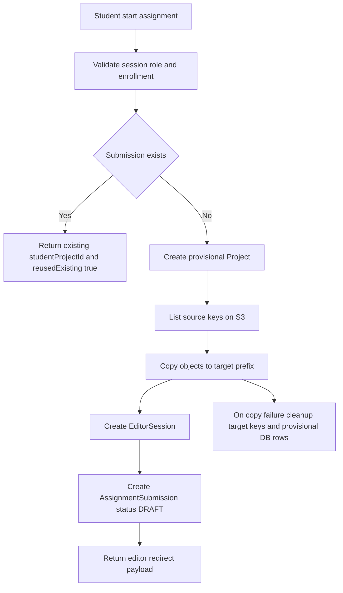

# Implementation Plan: Classroom/Courses Module

**Branch**: `classroom-courses` | **Date**: 2026-02-10 | **Spec**: [specification.md](./specification.md)
**Input**: Feature specification from `.specify/specs/classroom-courses/specification.md`

---

## Summary

Triển khai module Classroom/Courses cho S4VN-Webots theo hướng tích hợp chặt với hạ tầng hiện có của editor và project, đồng thời bổ sung đầy đủ quản trị người dùng theo vai trò:

1. Bổ sung schema Prisma cho `Course`, `Enrollment`, `Assignment`, `AssignmentSubmission` và role user `ADMIN|TEACHER|STUDENT`
2. Chuẩn hóa API theo Next.js App Router với contract rõ ràng cho auth, request, response, validation, error code
3. Bổ sung luồng nghiệp vụ Admin tạo teacher mới hoặc gán quyền teacher cho user có sẵn
4. Bổ sung luồng Teacher tạo lớp, tìm học sinh có sẵn, tạo học sinh mới, ghi danh và huỷ ghi danh
5. Triển khai luồng assignment deep copy + submit overwrite trên cùng submission record
6. MVP dừng ở trạng thái submit `DRAFT`, `PENDING`, `QUEUED`, chưa chấm tự động thật

---

## Technical Context

**Language/Version**: TypeScript 5.x, Next.js App Router, Prisma PostgreSQL
**Primary Dependencies**: Next.js, Prisma, AWS SDK S3 client hiện có, NextAuth JWT session
**Storage**: PostgreSQL cho metadata và RBAC, S3 cho project/editor files
**Testing**: Jest API tests + integration tests + RBAC matrix tests
**Target Platform**: Web app trong `S4VN-Simulation-Frontend`
**Project Type**: Web application trong monorepo
**Performance Goals**:
- Start assignment idempotent ngay cả khi concurrent requests
- Submit luôn cập nhật một submission record duy nhất
- Student search API p95 dưới mức chấp nhận cho dashboard lớp học nội bộ
**Constraints**:
- Không phá flow editor/project hiện tại
- Không nâng cấp dependency nếu không bắt buộc
- Giữ public API cũ hoạt động
- Các thay đổi RBAC phải backward-compatible cho session hiện tại
**Scale/Scope**:
- Nhiều course/assignment đồng thời
- Teacher quản lý lớp có số lượng student trung bình theo mô hình trường học

---

## Existing Integration Baseline

Các điểm tích hợp quan trọng đã xác định:

- Session/auth hiện tại:
  - `S4VN-Simulation-Frontend/lib/auth-helpers.ts`
  - `S4VN-Simulation-Frontend/lib/auth.ts`
- Schema nền: `User`, `Project`, `EditorSession` tại `S4VN-Simulation-Frontend/prisma/schema.prisma`
- Editor route: `S4VN-Simulation-Frontend/app/editor/[projectId]/page.tsx`
- Editor APIs: `S4VN-Simulation-Frontend/app/api/editor/load/route.ts`, `.../tree/route.ts`, `.../save/route.ts`
- S3 editor utility: `S4VN-Simulation-Frontend/lib/editor/s3-editor.ts`
- Auth/ownership patterns:
  - `S4VN-Simulation-Frontend/lib/project-ownership.ts`
  - competition APIs trong `S4VN-Simulation-Frontend/app/api/competitions/...`
- User API baseline:
  - `S4VN-Simulation-Frontend/app/api/users/uniqueness/route.ts`
  - `S4VN-Simulation-Frontend/app/api/users/delete/route.ts`

---

## Architecture Decisions Locked

1. Phân quyền MVP:
   - `ADMIN`: quản trị user và role teacher
   - `TEACHER`: quản trị course, assignment, enrollment trong course own
   - `STUDENT`: join/start/submit và xem dữ liệu cá nhân
2. Ownership model:
   - `Course.teacherId` là nguồn sự thật cho quyền quản trị lớp
   - Teacher chỉ thao tác được tài nguyên thuộc course do mình sở hữu
3. Submission policy:
   - 1 record duy nhất theo `(assignmentId, studentId)`
   - submit lại overwrite status/score/feedback
4. Auto-grading scope:
   - MVP chỉ cập nhật trạng thái `PENDING` và `QUEUED`
   - Chấm thật qua sim server ở phase sau

---

## Proposed Data Model Design

## A. New enums

- `UserRole`: `ADMIN`, `TEACHER`, `STUDENT`
- `EnrollmentStatus`: `ACTIVE`, `LEFT`, `REMOVED`
- `AssignmentSubmissionStatus`: `DRAFT`, `PENDING`, `QUEUED`, `RUNNING`, `GRADED`, `FAILED`

## B. New models

- `Course`
  - owner: `teacherId -> User`
  - unique `joinCode`
  - soft-delete qua `isArchived`
- `Enrollment`
  - unique `(courseId, studentId)`
  - chỉ student membership
  - trạng thái vòng đời enrollment
- `Assignment`
  - thuộc `Course`
  - tham chiếu template project qua `templateProjectId -> Project`
- `AssignmentSubmission`
  - unique `(assignmentId, studentId)`
  - liên kết project clone qua `studentProjectId -> Project`
  - status machine cho MVP + phase sau
- `UserAuditLog` tùy chọn cho MVP nhẹ
  - ghi hành động role change, enrollment change

## C. Relation extension

- `User`
  - thêm field `role`
  - thêm collections cho teaching courses, enrollments, assignment submissions
- `Project`
  - thêm quan hệ project làm template assignment
  - thêm quan hệ project dùng cho assignment submission

---

## API Architecture

## A. Courses API

### A.1 Admin user-role endpoints

1. `POST /api/admin/users/teachers`
   - Mục tiêu: tạo tài khoản teacher mới
   - Auth: `ADMIN`
   - Validation: email unique, password policy
   - Error map: `401`, `403 FORBIDDEN_ROLE`, `409 EMAIL_ALREADY_EXISTS`, `422`

2. `PATCH /api/admin/users/{userId}/role`
   - Mục tiêu: gán role teacher cho user có sẵn
   - Auth: `ADMIN`
   - Validation: role target hợp lệ, không downgrade admin hiện tại qua endpoint này
   - Error map: `401`, `403`, `404 USER_NOT_FOUND`, `409 INVALID_ROLE_TRANSITION`

### A.2 Course lifecycle endpoints

1. `POST /api/courses`
   - Auth: `TEACHER`
   - Tạo course với `joinCode` auto-generated
2. `GET /api/courses`
   - Auth: mọi role có session
   - `ADMIN`: list toàn cục theo filter
   - `TEACHER`: list course own
   - `STUDENT`: list course active enrollment
3. `GET /api/courses/{courseId}`
   - Auth: `ADMIN` hoặc `TEACHER owner` hoặc `STUDENT enrolled`
4. `PATCH /api/courses/{courseId}`
   - Auth: `TEACHER owner`
5. `DELETE /api/courses/{courseId}`
   - Auth: `TEACHER owner`
   - Soft delete qua `isArchived`

### A.3 Student search/create/enrollment endpoints

1. `GET /api/courses/{courseId}/students/search`
   - Auth: `TEACHER owner`
   - Query: `query`, `limit`
   - Chỉ trả role `STUDENT`
2. `POST /api/courses/{courseId}/students`
   - Auth: `TEACHER owner`
   - Tạo student mới
   - Option `autoEnroll=true` để ghi danh ngay
3. `POST /api/courses/{courseId}/enrollments`
   - Auth: `TEACHER owner`
   - Ghi danh student có sẵn
4. `DELETE /api/courses/{courseId}/enrollments/{studentId}`
   - Auth: `TEACHER owner`
   - Huỷ ghi danh bằng update status `REMOVED`
5. `POST /api/courses/join`
   - Auth: `STUDENT`
   - Join bằng joinCode

## B. Assignments API

1. `POST /api/courses/{courseId}/assignments`
   - Auth: `TEACHER owner`
   - Validate templateProject ownership/visibility
2. `GET /api/courses/{courseId}/assignments`
   - Auth: `TEACHER owner` hoặc `STUDENT enrolled`
3. `GET /api/assignments/{assignmentId}`
   - Auth: `TEACHER owner` hoặc `STUDENT enrolled`
4. `PATCH /api/assignments/{assignmentId}`
   - Auth: `TEACHER owner`
5. `DELETE /api/assignments/{assignmentId}`
   - Auth: `TEACHER owner`
6. `POST /api/assignments/{assignmentId}/start`
   - Auth: `STUDENT enrolled`
   - Deep copy + idempotency response `reusedExisting`

## C. Submissions API

1. `POST /api/assignments/{assignmentId}/submit`
   - Auth: `STUDENT enrolled`
   - Upsert overwrite record submission duy nhất
2. `GET /api/assignments/{assignmentId}/submission/me`
   - Auth: `STUDENT enrolled`
3. `GET /api/assignments/{assignmentId}/submissions`
   - Auth: `TEACHER owner`
4. `PATCH /api/submissions/{submissionId}/grade`
   - Phase sau, auth `TEACHER owner` hoặc service token

## D. API guard rules

### RBAC matrix

- **ADMIN allowed**:
  - Tạo teacher mới
  - Gán role teacher
  - Tra cứu user quản trị
- **TEACHER allowed**:
  - CRUD course own
  - Student search/create/enroll/unenroll trong course own
  - CRUD assignment trong course own
  - Xem submissions trong course own
- **STUDENT allowed**:
  - Join course
  - Xem course/assignment có enrollment active
  - Start/submit assignment cá nhân

### Deny rules

- `401 UNAUTHORIZED`: thiếu session
- `403 FORBIDDEN_ROLE`: role không đủ quyền
- `403 FORBIDDEN_OWNER_MISMATCH`: teacher không sở hữu course
- `403 ENROLLMENT_REQUIRED`: student chưa active enrollment
- `404`: tài nguyên không tồn tại
- `409`: conflict unique enrollment/submission
- `422`: request không qua validation

### Request-response normalization

- Success:
  - `{ success: true, data: ... }`
- Error:
  - `{ success: false, error: { code, message, details? } }`

---

## Deep Copy Strategy

## A. Clone source/target

- Source editor files: `editor/{templateProjectId}/**`
- Target editor files: `editor/{newProjectId}/**`
- Optional simulation assets copy nếu cần: `assets/simulations/{templateProjectId}/**` -> `assets/simulations/{newProjectId}/**`

## B. Orchestration flow

## C. Idempotency and concurrency

- Unique key `(assignmentId, studentId)` là guard cứng
- `start` endpoint dùng transaction + retry on unique conflict
- Nếu request song song, chỉ một request tạo mới; request còn lại lấy record đã có

## D. Failure handling

- DB transaction chỉ bao phần DB
- S3 copy thất bại -> cleanup keys đã copy + rollback bản ghi provisioning
- Ghi log lỗi chi tiết để hỗ trợ debug vận hành

---

## UI and Editor Integration Plan

## A. New pages under `app/courses`

- `app/courses/page.tsx`
- `app/courses/join/page.tsx`
- `app/courses/new/page.tsx`
- `app/courses/[courseId]/page.tsx`
- `app/courses/[courseId]/students/page.tsx`
- `app/courses/[courseId]/assignments/new/page.tsx`
- `app/courses/[courseId]/assignments/[assignmentId]/page.tsx`

UI components bắt buộc cho tính khả thi:
- Student search panel
- Create student modal
- Enrollment table và actions
- RBAC-aware action buttons

## B. Editor hook

- Redirect start success -> `/editor/{studentProjectId}?courseId=...&assignmentId=...`
- Editor toolbar hiện nút submit khi có `assignmentId` trong context
- Submit xong quay lại assignment detail và hiển thị status hiện tại

---

## Implementation Phases

## Phase 1 - Setup

1. Cập nhật `prisma/schema.prisma` cho role enum, classroom models, relations
2. Tạo migration mới và generate Prisma client
3. Thêm middleware/helper RBAC dùng chung cho API routes
4. Tạo skeleton API routes cho admin users, courses, enrollments, assignments, submissions
5. Tạo skeleton pages và components cho course/student management
6. Seed/dev fixtures cho admin teacher student

## Phase 2 - Core

1. Admin flows:
   - create teacher
   - assign teacher role
2. Teacher flows:
   - create/update/archive course
   - student search
   - create student from class context
   - enroll/unenroll student
3. Assignment flows:
   - assignment CRUD
   - start assignment deep copy
4. Submission flows:
   - submit overwrite
   - teacher list submissions
5. Editor integration:
   - submit button and return navigation

## Phase 3 - Later Enhancements

1. Queue integration với sim server
2. Auto grading thật và callback status updates
3. Manual grading/feedback nâng cao
4. Policies mở rộng: deadline lock, attempt limits, anti-cheat

---

## Migration Strategy

- Migrate additive only: thêm enum role, bảng classroom, index và unique constraints
- Migration dữ liệu user:
  - user hiện có map role mặc định `STUDENT` hoặc theo quy tắc migration
  - seed ít nhất một `ADMIN` bootstrap
- Không đổi contract của existing editor routes

## Rollback Notes

- DB rollback qua Prisma migration rollback workflow của dự án
- Runtime rollback cho deep copy lỗi:
  - xóa target S3 keys đã copy
  - xóa bản ghi DB provisional project/submission
- Role rollback:
  - nếu lỗi migration role, restore snapshot trước migration và disable admin endpoints
- Feature-level rollback:
  - gate truy cập route Classroom bằng feature flag server config

---

## Testing and Verification Strategy

## A. Schema tests

- Verify unique constraints:
  - `(courseId, studentId)`
  - `(assignmentId, studentId)`
- Verify role enum và default role hợp lệ
- Verify relations với `User` và `Project`

## B. API tests

- Auth tests: unauthorized cases
- RBAC tests theo ma trận Admin/Teacher/Student
- Validation tests: email, join code, template project ownership
- Admin tests:
  - create teacher
  - assign teacher role
- Teacher tests:
  - create/update course
  - search/create/enroll/unenroll student
- Idempotency tests: start assignment concurrent requests
- Submit overwrite tests: không phát sinh submission record thứ hai

## C. Integration tests

- Deep copy simulation với mocked S3 client
- End-to-end flow:
  - Admin -> Teacher setup
  - Teacher -> class setup
  - Student -> start/submit
- Editor redirect and submit context checks

## D. Manual verification checklist

1. Admin tạo teacher mới
2. Admin gán role teacher cho user có sẵn
3. Teacher tạo course
4. Teacher tìm student có sẵn và enroll
5. Teacher tạo student mới và auto-enroll
6. Student join course bằng join code
7. Student start assignment lần 1 tạo clone thành công
8. Student start assignment lần 2 trả về clone cũ
9. Student submit nhiều lần chỉ có 1 record submission cập nhật
10. Teacher xem danh sách submissions của lớp mình

---

## Risks and Mitigations

1. Role migration sai mapping user hiện có
   - Mitigation: migration script có dry-run + backup + verify sample
2. Permission leakage giữa teacher courses
   - Mitigation: owner check bắt buộc theo `courseId` ở service layer
3. Partial S3 copy
   - Mitigation: manifest verify + cleanup
4. Race condition start/submit
   - Mitigation: unique constraints + transaction + retry
5. Student creation abuse
   - Mitigation: teacher quota/rate-limit trong phase hardening

---

## Handoff Criteria to Code Mode

Kế hoạch được xem là sẵn sàng khi:

1. Spec file mô tả đầy đủ scope RBAC + API contracts + luồng Admin/Teacher/Student
2. Plan file chốt schema/API/deep-copy/UI integration + migration role strategy
3. Tasks file tách rõ Setup/Core/Later, có backend frontend migration test và tiêu chí nghiệm thu
4. Rủi ro migration/rollback đã được mô tả rõ
