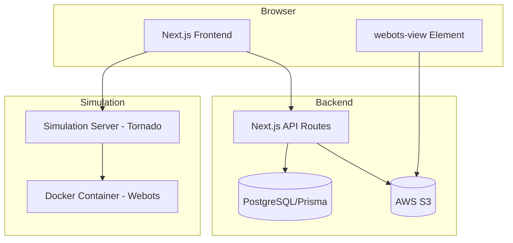
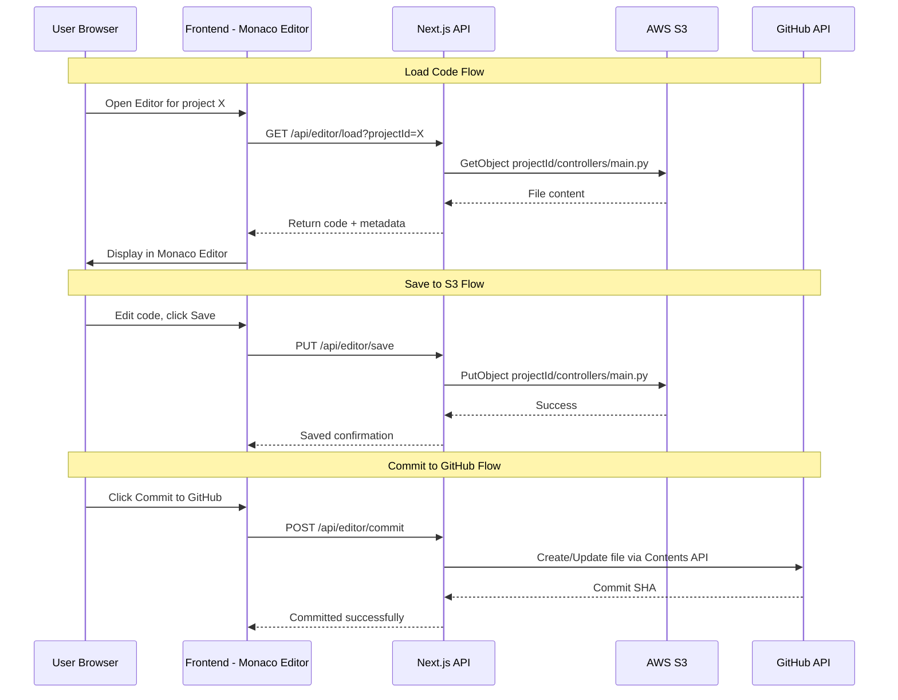
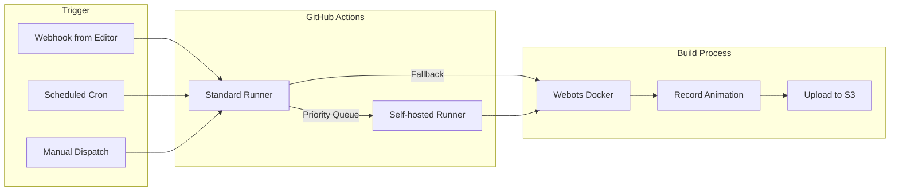
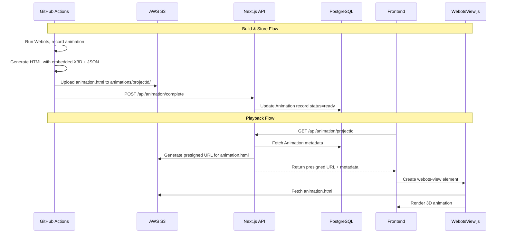
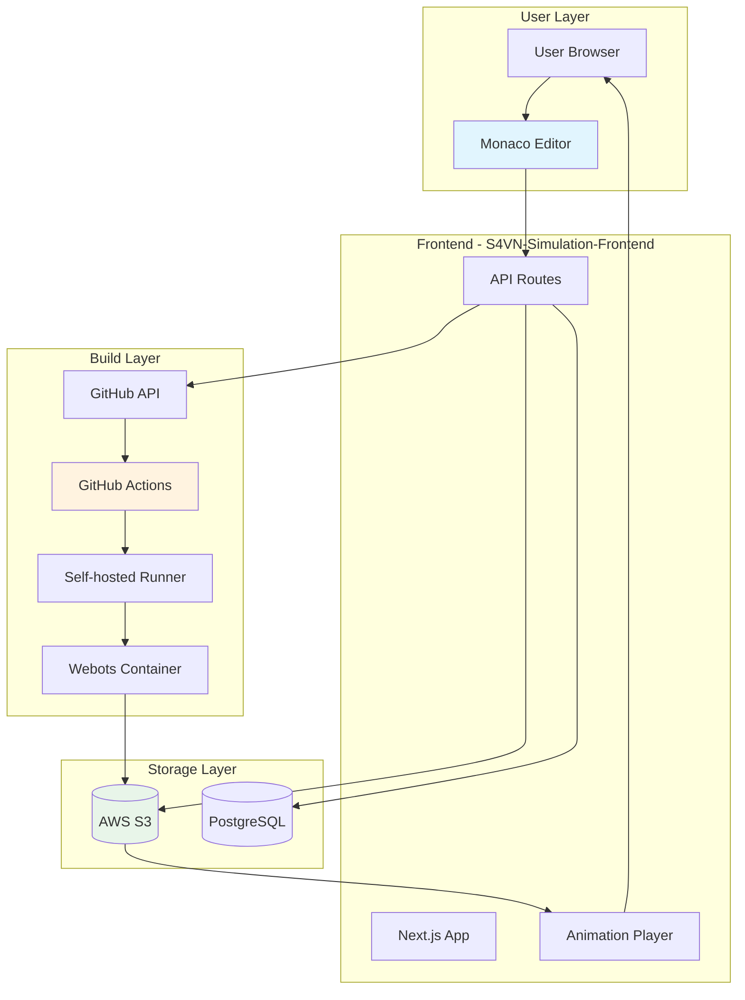
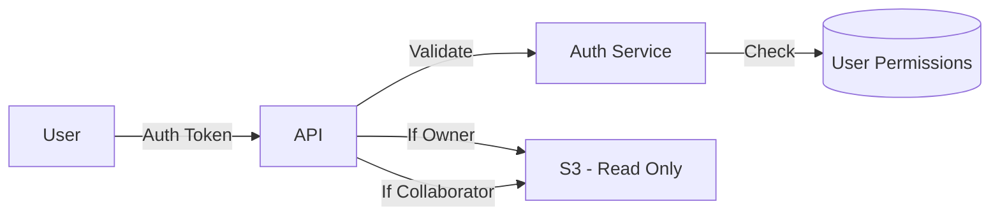

# Feature Specification: Online Editor & Animation Build System

**Feature Branch**: `online-editor-animation-build`  
**Created**: 2026-02-06  
**Status**: Draft  
**Input**: User description: "Xây dựng hệ thống Online Editor & Animation Build để giảm tải mô phỏng cho S4VN-Webots platform"

---

## 1. Executive Summary

Hệ thống "Online Editor & Animation Build" nhằm mục đích:

1. **Giảm tải simulation server** - Thay vì chạy simulation real-time tốn GPU, sử dụng **pre-recorded animation HTML** cho các use case preview/demo
2. **Cung cấp Online Editor** - Cho phép người dùng chỉnh sửa code robot controller trực tiếp trên web, lưu về S3/GitHub
3. **Tích hợp Build System** - Sử dụng GitHub Actions hoặc Self-hosted Runner để build animation từ code

---

## 2. Phân Tích Context Hiện Tại

### 2.1 Kiến Trúc Nền Tảng Hiện Tại



**Các điểm chính:**
- [`docs/PLATFORM_BUILD_DESCRIPTION.md`](docs/PLATFORM_BUILD_DESCRIPTION.md:1): Mô tả kiến trúc 3 tầng
- [`S4VN-Simulation-Frontend/lib/s3.ts`](S4VN-Simulation-Frontend/lib/s3.ts:1): S3 client với folders: animation, scene, proto, assets
- [`S4VN-Simulation-Frontend/lib/animation-utils.ts`](S4VN-Simulation-Frontend/lib/animation-utils.ts:1): Xử lý animation X3D/JSON

### 2.2 Tham Chiếu: pal-webots-animation-action

Dựa trên phân tích [`pal-webots-animation-action`](pal-webots-animation-action/README.md:1):

**Cách hoạt động:**
1. GitHub Action chạy Webots headless với `xvfb-run`
2. Inject `animation_recorder` supervisor vào world file
3. Record animation với duration cố định
4. Output: HTML file tự chứa với scene.x3d + animation.json
5. Push lên gh-pages branch

**Key code paths:**
- [`wb_animation_action/animation.py`](pal-webots-animation-action/wb_animation_action/animation.py:70): `generate_animation_for_world()`
- [`wb_animation_action/competition.py`](pal-webots-animation-action/wb_animation_action/competition.py:139): `generate_competition()`

---

## 3. Trả Lời 3 Câu Hỏi Kiến Trúc

### 3.1 Câu Hỏi 1: Online Editor từ S3

**Câu hỏi**: Khả thi không? Kiến trúc thế nào (S3 -> Editor -> Commit/Save)?

**Trả lời**: ✅ **KHẢ THI** với kiến trúc sau:



**Tech Stack đề xuất:**

| Component | Lựa chọn | Lý do |
|-----------|----------|-------|
| Code Editor | **Monaco Editor** | Lightweight, VS Code core, dễ embed |
| File Storage | **S3** (primary) | Đã có sẵn, presigned URLs |
| Version Control | **GitHub API** | Contents API cho single file, không cần clone |
| Sync | **Bidirectional** | S3 ↔ GitHub qua webhook |

**Kiến trúc S3 Storage:**

```text
s3://s4vn-simulation/
├── editor/
│   └── {userId}/
│       └── {projectId}/
│           ├── controllers/
│           │   └── robot_controller.py
│           ├── worlds/
│           │   └── world.wbt
│           └── metadata.json
```

**So sánh Theia vs Monaco:**

| Tiêu chí | Monaco Editor | Theia IDE |
|----------|---------------|-----------|
| Bundle size | ~2MB | ~50MB+ |
| Load time | <1s | 5-10s |
| Features | Code editing only | Full IDE (terminal, debugger) |
| Complexity | Low | High (cần backend service) |
| Use case | Quick edits | Full development |

**Khuyến nghị**: Sử dụng **Monaco Editor** cho MVP vì:
- Nhẹ, load nhanh
- Đủ cho việc edit controller code
- Có thể upgrade lên Theia sau nếu cần

### 3.2 Câu Hỏi 2: Build System - GitHub Actions vs Self-hosted Runner

**Câu hỏi**: Ưu/nhược điểm và cách tích hợp. Cách build ra animation HTML.

#### So Sánh Chi Tiết:

| Tiêu chí | GitHub Actions | Self-hosted Runner |
|----------|----------------|-------------------|
| **Chi phí** | 2000 phút/tháng free, sau đó $0.008/phút | Chi phí server (~$50-100/tháng cho GPU) |
| **GPU** | Không có GPU | Có thể dùng GPU |
| **Thời gian queue** | 0-30s | 0s (dedicated) |
| **Build time** | ~5-10 phút/animation (no GPU) | ~1-3 phút/animation (with GPU) |
| **Concurrency** | 20 concurrent jobs | Phụ thuộc server |
| **Maintenance** | Không cần | Cần quản lý server |
| **Isolation** | Tốt (fresh container mỗi job) | Cần setup Docker |

#### Kiến Trúc Đề Xuất: Hybrid Approach



**Workflow cho Animation Build:**

```yaml
# .github/workflows/build-animation.yml
name: Build Animation

on:
  workflow_dispatch:
    inputs:
      project_url:
        description: S3 or GitHub URL to project
        required: true
      duration:
        description: Animation duration in seconds
        default: '10'
  repository_dispatch:
    types: [build-animation]

jobs:
  build:
    runs-on: ubuntu-latest  # or self-hosted for GPU
    container:
      image: cyberbotics/webots.cloud:R2023b-ubuntu22.04
    steps:
      - name: Checkout animation action
        uses: actions/checkout@v4
        with:
          repository: pal-admin/webots-animation-action
          
      - name: Download project from S3
        run: |
          aws s3 cp s3://$BUCKET/$PROJECT_PATH ./project --recursive
          
      - name: Record animation
        run: |
          xvfb-run webots --stdout --stderr --batch \
            --mode=fast --no-rendering \
            ./project/worlds/world.wbt
            
      - name: Upload animation to S3
        run: |
          aws s3 cp ./output/animation.html \
            s3://$BUCKET/animations/$PROJECT_ID/animation.html
            
      - name: Notify completion
        run: |
          curl -X POST $WEBHOOK_URL \
            -d '{"status": "completed", "url": "$ANIMATION_URL"}'
```

**Cách tích hợp từ Frontend:**

```typescript
// lib/animation-build.ts
export async function triggerAnimationBuild(
  projectId: string,
  duration: number = 10
): Promise<BuildJob> {
  // Option 1: GitHub API dispatch
  const response = await fetch(
    `https://api.github.com/repos/${REPO}/dispatches`,
    {
      method: 'POST',
      headers: {
        Authorization: `token ${GITHUB_TOKEN}`,
        Accept: 'application/vnd.github.v3+json',
      },
      body: JSON.stringify({
        event_type: 'build-animation',
        client_payload: {
          project_id: projectId,
          duration: duration,
          callback_url: `${API_BASE}/api/animation/callback`,
        },
      }),
    }
  );
  
  return { jobId: generateJobId(), status: 'queued' };
}
```

### 3.3 Câu Hỏi 3: Storage & Playback

**Câu hỏi**: Quy trình lưu HTML lên S3 và frontend play lại.



**S3 Storage Structure cho Animations:**

```text
s3://s4vn-simulation/
├── animations/
│   └── {animationId}/
│       ├── animation.html      # Self-contained HTML
│       ├── scene.x3d           # Fallback scene file
│       ├── animation.json      # Fallback animation data
│       └── thumbnail.jpg       # Preview image
```

**Animation HTML Format** (self-contained):

```html
<!DOCTYPE html>
<html>
<head>
  <script src="https://cyberbotics.com/wwi/R2023b/WebotsView.js"></script>
</head>
<body>
  <webots-view id="viewer"></webots-view>
  <script>
    const scene = `...base64 encoded X3D...`;
    const animation = `...base64 encoded JSON...`;
    
    document.getElementById('viewer')
      .loadAnimation(
        URL.createObjectURL(new Blob([atob(scene)])),
        URL.createObjectURL(new Blob([atob(animation)]))
      );
  </script>
</body>
</html>
```

**Frontend Playback Component:**

```tsx
// components/AnimationPlayer.tsx
export function AnimationPlayer({ animationId }: Props) {
  const [url, setUrl] = useState<string>();
  
  useEffect(() => {
    async function loadAnimation() {
      const res = await fetch(`/api/animation/${animationId}`);
      const data = await res.json();
      setUrl(data.presignedUrl);
    }
    loadAnimation();
  }, [animationId]);
  
  if (!url) return <Skeleton />;
  
  return (
    <iframe
      src={url}
      className="w-full h-[600px] border-0"
      sandbox="allow-scripts allow-same-origin"
    />
  );
}
```

---

## 4. Sơ Đồ Luồng Dữ Liệu Tổng Thể



---

## 5. User Scenarios & Testing

### User Story 1 - Edit Controller Code Online (Priority: P1)

Người dùng muốn chỉnh sửa code robot controller trực tiếp trên web mà không cần clone repo về máy.

**Why this priority**: Core value proposition - giảm barrier để người dùng có thể nhanh chóng thử nghiệm

**Independent Test**: Có thể test bằng cách load một project, edit code, save về S3, verify file thay đổi

**Acceptance Scenarios:**

1. **Given** user đã login và có project trên S3, **When** user mở Editor page, **Then** code được load và hiển thị trong Monaco Editor
2. **Given** user đã edit code, **When** user click Save, **Then** file được update trên S3 và có confirmation message
3. **Given** user muốn sync với GitHub, **When** user click Commit, **Then** file được commit lên GitHub repo

---

### User Story 2 - Build Animation from Code (Priority: P2)

Người dùng muốn tạo animation preview từ code đã viết mà không cần chạy simulation real-time.

**Why this priority**: Giảm tải server, tạo shareable preview

**Independent Test**: Trigger build, wait for completion, verify animation playback

**Acceptance Scenarios:**

1. **Given** user có project với valid world file, **When** user click Build Animation, **Then** GitHub Action được trigger
2. **Given** build job đang chạy, **When** user refresh page, **Then** thấy build status là In Progress
3. **Given** build hoàn thành, **When** user mở animation page, **Then** animation play được trong WebotsView

---

### User Story 3 - View Pre-recorded Animation (Priority: P1)

Người dùng muốn xem animation đã được record trước đó.

**Why this priority**: Core playback feature, không cần server resources

**Independent Test**: Load animation URL, verify 3D rendering works

**Acceptance Scenarios:**

1. **Given** animation đã tồn tại trên S3, **When** user truy cập animation URL, **Then** WebotsView load và play animation
2. **Given** animation đang load, **When** user thấy loading indicator, **Then** progress được hiển thị
3. **Given** animation lỗi, **When** load fails, **Then** error message được hiển thị với retry option

---

### Edge Cases

- **Network failure during save**: Auto-save locally, retry khi reconnect
- **Concurrent edits**: Lock mechanism hoặc conflict resolution
- **Build timeout**: Cancel job sau 30 phút, notify user
- **Invalid world file**: Validate trước khi trigger build
- **Large animation file**: Progressive loading, compression

---

## 6. Requirements

### Functional Requirements

- **FR-001**: System MUST cho phép load code từ S3 vào Monaco Editor
- **FR-002**: System MUST cho phép save code về S3 với versioning
- **FR-003**: System MUST cho phép commit code lên GitHub qua API
- **FR-004**: System MUST trigger GitHub Actions workflow để build animation
- **FR-005**: System MUST upload animation HTML lên S3 sau khi build
- **FR-006**: System MUST hiển thị animation trong WebotsView component
- **FR-007**: System MUST hiển thị build status (queued, running, completed, failed)
- **FR-008**: System MUST notify user khi build hoàn thành (WebSocket/polling)

### Non-Functional Requirements

- **NFR-001**: Editor load time MUST < 2 giây
- **NFR-002**: Animation build SHOULD complete trong < 10 phút
- **NFR-003**: Animation playback MUST work trên mobile browsers
- **NFR-004**: System MUST hỗ trợ > 100 concurrent editor sessions

### Key Entities

- **EditorSession**: userId, projectId, currentFile, lastSaved, isDirty
- **BuildJob**: id, projectId, status, triggeredAt, completedAt, outputUrl
- **Animation**: id, projectId, version, s3Url, duration, createdAt

---

## 7. Security Considerations

### 7.1 API Keys & Credentials

| Secret | Storage | Access |
|--------|---------|--------|
| AWS S3 credentials | Environment variables | Server-side only |
| GitHub PAT | GitHub Secrets | GitHub Actions only |
| Editor session tokens | JWT | Short-lived, refresh tokens |

### 7.2 Sandboxing

**Editor Sandboxing:**
- Monaco Editor runs in browser, no server-side code execution
- Code validation trước khi save (syntax check)
- File type whitelist (py, cpp, java, js only)

**Build Sandboxing:**
- Webots chạy trong Docker container
- Network isolation trong container
- Resource limits: 4GB RAM, 2 CPU, 30 phút timeout
- No persistent storage access ngoài project folder

### 7.3 Access Control



---

## 8. Tech Stack Summary

| Layer | Technology | Rationale |
|-------|------------|-----------|
| **Editor** | Monaco Editor | Lightweight, VS Code core |
| **Frontend** | Next.js 14 | Existing stack |
| **API** | Next.js API Routes | Existing stack |
| **Storage** | AWS S3 | Existing stack, presigned URLs |
| **Database** | PostgreSQL + Prisma | Existing stack |
| **Build** | GitHub Actions | Free tier, easy integration |
| **Container** | cyberbotics/webots.cloud | Official Webots Docker |
| **Playback** | WebotsView.js | Official Cyberbotics viewer |

---

## 9. References

- [`pal-webots-animation-action`](pal-webots-animation-action/README.md:1): Reference implementation
- [`S4VN-Simulation-Frontend/lib/s3.ts`](S4VN-Simulation-Frontend/lib/s3.ts:1): S3 utilities
- [`S4VN-Simulation-Frontend/docs/ANIMATION_TECHNICAL_SPIKE.md`](S4VN-Simulation-Frontend/docs/ANIMATION_TECHNICAL_SPIKE.md:1): Animation technical details
- [`docs/PLATFORM_BUILD_DESCRIPTION.md`](docs/PLATFORM_BUILD_DESCRIPTION.md:1): Platform architecture
