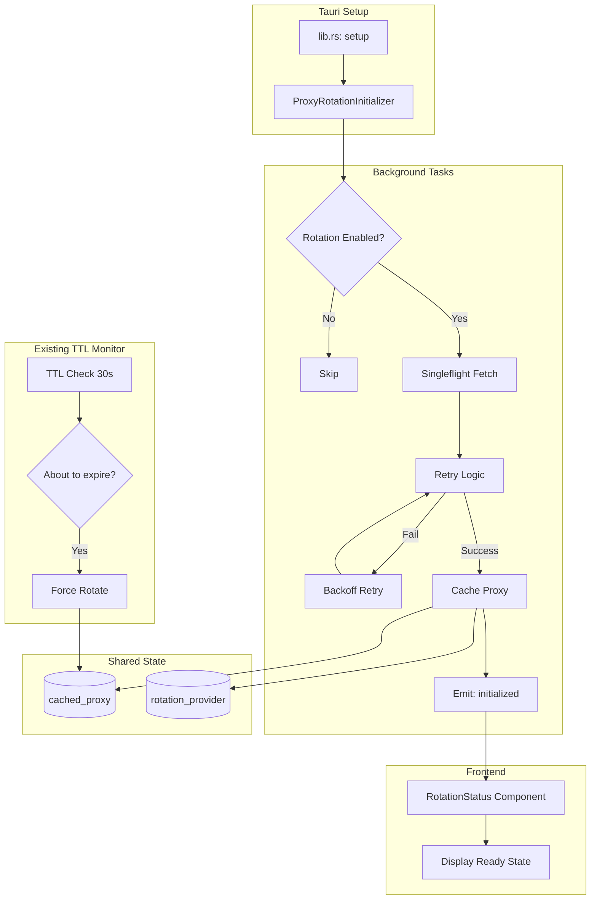
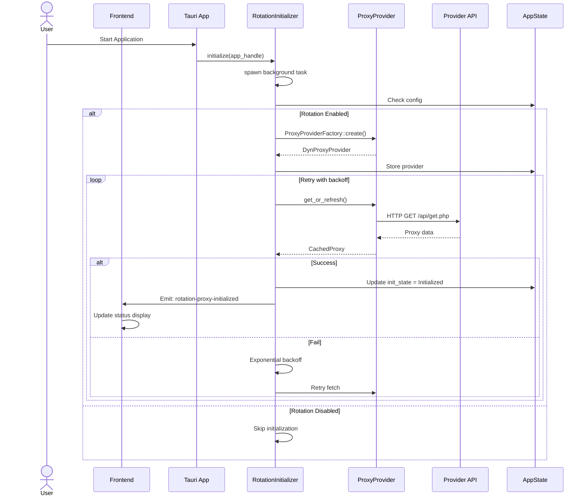
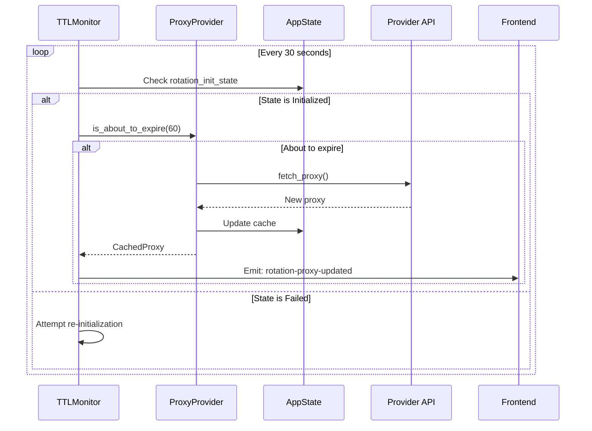

# Technical Specification: Proxy Rotation Auto-Initialization

## Overview

Tài liệu này mô tả thiết kế kỹ thuật cho việc khởi tạo tự động Proxy Rotation khi app khởi động, không phụ thuộc vào UI và không chặn UI thread.

## Current State Analysis

### Luồng hiện tại

```
App Start
    ↓
lib.rs:run() - setup()
    ↓
[Chờ UI mở Settings] → NgườI dùng click "Start Proxy"
    ↓
start_proxy() command
    ↓
Tạo RotationProxyProvider (chưa fetch)
    ↓
Lần đầu request đến proxy → get_valid_proxy() → fetch từ provider
```

### Vấn đề hiện tại

1. **UI-blocking**: `start_proxy()` chạy đồng bộ trong Tauri command
2. **Lazy initialization**: Provider được tạo nhưng chưa fetch proxy ngay
3. **No singleflight**: Có thể có nhiều request cùng gọi fetch_proxy() đồng thờI
4. **No auto-init**: PhảI đợI user mở Settings và start proxy

## Proposed Architecture

### Luồng mới

```
App Start
    ↓
lib.rs:run() - setup()
    ↓
┌─────────────────────────────────────────────────────────────┐
│ ProxyRotationInitializer::initialize(app_handle)            │
│ - Spawn background task (non-blocking)                      │
│ - Check if rotation enabled in config                       │
│ - Create provider                                           │
│ - Fetch initial proxy (with retry + singleflight)           │
│ - Emit event: rotation-proxy-initialized                    │
└─────────────────────────────────────────────────────────────┘
    ↓
UI Ready → Có thể dùng proxy ngay (đã cached)
    ↓
TTL Monitor (existing) tiếp tục refresh khi hết hạn
```

### Component Diagram



## Detailed Design

### 1. ProxyRotationInitializer Module

**File mới**: `src-tauri/src/proxy/initializer.rs`

```rust
//! Proxy Rotation Initializer
//! 
//! Handles automatic initialization of proxy rotation on app startup.
//! Runs in background to avoid blocking UI thread.

use std::sync::Arc;
use tokio::sync::Mutex;
use std::time::Duration;
use log::{info, warn, error};
use tauri::AppHandle;

use crate::config::AppConfig;
use crate::proxy::{ProxyProviderFactory, DynProxyProvider};
use crate::state::AppState;
use crate::types::proxy::CachedProxy;

/// Manages automatic initialization of proxy rotation
pub struct ProxyRotationInitializer {
    /// Singleflight guard to prevent concurrent fetches
    initialization_in_progress: Arc<Mutex<bool>>,
    /// Retry configuration
    max_retries: u32,
    base_retry_delay_ms: u64,
}

impl ProxyRotationInitializer {
    pub fn new() -> Self {
        Self {
            initialization_in_progress: Arc::new(Mutex::new(false)),
            max_retries: 3,
            base_retry_delay_ms: 2000,
        }
    }

    /// Initialize proxy rotation in background
    /// This function is non-blocking and returns immediately
    pub fn initialize(&self, app_handle: AppHandle) {
        let initializer = Arc::new(self.clone());
        
        tauri::async_runtime::spawn(async move {
            info!("[RotationInit] Starting background initialization");
            
            // Load config
            let config = crate::config::load_config();
            
            // Check if rotation is enabled
            if !Self::is_rotation_enabled(&config) {
                info!("[RotationInit] Rotation not enabled, skipping initialization");
                return;
            }
            
            // Perform initialization with singleflight
            let _ = initializer.initialize_with_singleflight(app_handle, config).await;
        });
    }

    /// Check if rotation proxy is configured
    fn is_rotation_enabled(config: &AppConfig) -> bool {
        let effective_url = if config.use_system_proxy {
            // System proxy doesn't support rotation
            return false;
        } else {
            &config.proxy_url
        };
        
        effective_url.starts_with("rotation://") && 
        config.rotation_settings.is_some()
    }

    /// Initialize with singleflight pattern (prevents duplicate requests)
    async fn initialize_with_singleflight(
        &self,
        app_handle: AppHandle,
        config: AppConfig,
    ) -> Result<(), String> {
        // Try to acquire initialization lock
        let mut in_progress = self.initialization_in_progress.lock().await;
        
        if *in_progress {
            warn!("[RotationInit] Initialization already in progress, skipping");
            return Err("Initialization already in progress".to_string());
        }
        
        *in_progress = true;
        drop(in_progress); // Release lock before async operations
        
        let result = self.do_initialize(app_handle, config).await;
        
        // Reset flag
        let mut in_progress = self.initialization_in_progress.lock().await;
        *in_progress = false;
        
        result
    }

    /// Actual initialization logic with retry
    async fn do_initialize(
        &self,
        app_handle: AppHandle,
        config: AppConfig,
    ) -> Result<(), String> {
        let effective_url = config.proxy_url.clone();
        
        info!("[RotationInit] Creating provider for URL: {}", effective_url);
        
        // Create provider
        let provider = ProxyProviderFactory::create(&effective_url)
            .map_err(|e| format!("Failed to create provider: {}", e))?;
        
        // Store provider in state
        {
            let state = app_handle.state::<AppState>();
            let mut rotation_provider = state.rotation_provider.lock().unwrap();
            *rotation_provider = Some(provider.clone());
        }
        
        // Fetch initial proxy with retry
        let cached = self.fetch_with_retry(&provider).await?;
        
        info!(
            "[RotationInit] Successfully initialized with proxy: {}, expires in {}s",
            cached.http_proxy,
            cached.expires_in_seconds()
        );
        
        // Emit initialization event to frontend
        let _ = app_handle.emit("rotation-proxy-initialized", serde_json::json!({
            "success": true,
            "proxy": provider.resolve_proxy_url(&cached),
            "realIp": cached.real_ip,
            "ttl": cached.ttl_seconds,
            "expiresInSeconds": cached.expires_in_seconds(),
        }));
        
        Ok(())
    }

    /// Fetch proxy with exponential backoff retry
    async fn fetch_with_retry(
        &self,
        provider: &DynProxyProvider,
    ) -> Result<CachedProxy, String> {
        let mut last_error = String::new();
        
        for attempt in 0..self.max_retries {
            match provider.get_or_refresh().await {
                Ok(cached) => {
                    info!("[RotationInit] Fetch succeeded on attempt {}", attempt + 1);
                    return Ok(cached);
                }
                Err(e) => {
                    last_error = e.clone();
                    error!(
                        "[RotationInit] Fetch attempt {} failed: {}",
                        attempt + 1,
                        e
                    );
                    
                    // Check if this is a cooldown error - don't retry immediately
                    if e.contains("[WAITING_STATUS]") {
                        warn!("[RotationInit] Provider on cooldown, will retry later");
                        // Parse wait time if possible
                        if let Some(wait_secs) = Self::parse_cooldown_seconds(&e) {
                            // Wait for cooldown + small buffer
                            let delay = Duration::from_secs(wait_secs + 5);
                            warn!("[RotationInit] Waiting {}s before retry", delay.as_secs());
                            tokio::time::sleep(delay).await;
                            continue;
                        }
                    }
                    
                    if attempt < self.max_retries - 1 {
                        let delay = Duration::from_millis(
                            self.base_retry_delay_ms * 2_u64.pow(attempt)
                        );
                        warn!("[RotationInit] Retrying in {}ms", delay.as_millis());
                        tokio::time::sleep(delay).await;
                    }
                }
            }
        }
        
        Err(format!(
            "Failed to fetch proxy after {} attempts: {}",
            self.max_retries,
            last_error
        ))
    }

    /// Parse cooldown seconds from error message
    fn parse_cooldown_seconds(error: &str) -> Option<u64> {
        // Format: [WAITING_STATUS]30|Message
        let re = regex::Regex::new(r"\[WAITING_STATUS\](\d+)\|").ok()?;
        re.captures(error)?
            .get(1)?
            .as_str()
            .parse::<u64>()
            .ok()
    }
}

impl Clone for ProxyRotationInitializer {
    fn clone(&self) -> Self {
        Self {
            initialization_in_progress: Arc::new(Mutex::new(false)),
            max_retries: self.max_retries,
            base_retry_delay_ms: self.base_retry_delay_ms,
        }
    }
}
```

### 2. Integration with lib.rs

**File sửa**: `src-tauri/src/lib.rs`

Thêm vào trong `setup()` closure:

```rust
.setup(|app| {
    // ... existing setup code ...
    
    // Auto-initialize proxy rotation in background
    let app_handle = app.handle().clone();
    ProxyRotationInitializer::new().initialize(app_handle);
    
    Ok(())
})
```

### 3. Enhanced State Management

**File sửa**: `src-tauri/src/state.rs`

Thêm trạng thái khởi tạo:

```rust
pub struct AppState {
    // ... existing fields ...
    
    /// Rotation provider initialization state
    pub rotation_init_state: Mutex<RotationInitState>,
}

/// Tracks the initialization state of rotation proxy
#[derive(Debug, Clone)]
pub enum RotationInitState {
    /// Not initialized or not configured
    Idle,
    /// Initialization in progress
    Initializing,
    /// Successfully initialized with cached proxy
    Initialized {
        proxy_url: String,
        expires_at: std::time::Instant,
    },
    /// Failed to initialize
    Failed {
        error: String,
        retry_after: Option<std::time::Instant>,
    },
}

impl Default for RotationInitState {
    fn default() -> Self {
        RotationInitState::Idle
    }
}
```

### 4. Frontend Event Handling

**File sửa**: `src/lib/tauri/proxy.ts`

Thêm event listener:

```typescript
export async function onRotationProxyInitialized(
  callback: (data: {
    success: boolean;
    proxy?: string;
    realIp?: string;
    ttl?: number;
    expiresInSeconds?: number;
    error?: string;
  }) => void,
): Promise<UnlistenFn> {
  return listen("rotation-proxy-initialized", (event) => {
    callback(event.payload);
  });
}
```

**File sửa**: `src/components/settings/RotationStatus.tsx`

Thêm xử lý event khởi tạo:

```typescript
// Trong setup effect
createEffect(() => {
  // ... existing code ...
  
  const setupListeners = async () => {
    // ... existing listeners ...
    
    // Listen for initialization event
    unlistenInitialized = await onRotationProxyInitialized((data) => {
      if (data.success) {
        setStatus({
          active: true,
          currentProxy: data.proxy || "",
          realIp: data.realIp || "",
          ttlSeconds: data.ttl || 0,
          expiresInSeconds: data.expiresInSeconds || 0,
        });
        setTimeLeft(data.expiresInSeconds || 0);
        toastStore.success("Proxy rotation initialized");
      } else {
        setError(data.error || "Initialization failed");
      }
    });
  };
  
  void setupListeners();
  
  // ... cleanup ...
});
```

## Data Flow

### Sequence Diagram: Initialization Flow



### Sequence Diagram: TTL Monitor Integration



## Error Handling Strategy

### Retry Policy

| Error Type | Behavior |
|------------|----------|
| Network timeout | Exponential backoff (2s, 4s, 8s) |
| Provider cooldown | Wait for specified cooldown + 5s buffer |
| Invalid API key | Fail immediately, emit error event |
| Server error (5xx) | Exponential backoff, max 3 retries |
| Parse error | Retry once, then fail |

### State Transitions

```
Idle ──[config: rotation enabled]──> Initializing
    │                                    │
    │                                    ▼
    │                           [success]
    │                                    │
    │                                    ▼
    │                              Initialized
    │                                    │
    │                           [about to expire]
    │                                    │
    └────────────────────────────────────┘
    
Initializing ──[failure, retryable]──> Initializing (retry)
    │
    └──[failure, non-retryable]──> Failed
                                        │
                           [after cooldown]──> Initializing (retry)
```

## Performance Considerations

1. **Non-blocking**: Initialization chạy trong `tauri::async_runtime::spawn()`
2. **Singleflight**: `Mutex<bool>` đảm bảo chỉ có 1 request fetch tại 1 thờI điểm
3. **Lazy evaluation**: Chỉ khởi tạo khi rotation được enable trong config
4. **Memory efficient**: Cache được share giữa initializer và TTL monitor

## Security Considerations

1. **API Key**: Không log API key trong quá trình khởi tạo
2. **Proxy URL**: Mask credentials trong logs
3. **State exposure**: Chỉ expose necessary fields trong `RotationInitState`

## Testing Strategy

### Unit Tests

```rust
#[cfg(test)]
mod tests {
    use super::*;

    #[tokio::test]
    async fn test_singleflight_prevents_duplicate_fetches() {
        // Verify only one fetch happens when multiple init calls are made
    }

    #[tokio::test]
    async fn test_retry_with_backoff() {
        // Verify exponential backoff behavior
    }

    #[tokio::test]
    async fn test_cooldown_parsing() {
        // Verify [WAITING_STATUS] parsing
    }
}
```

### Integration Tests

1. Test app startup với rotation enabled
2. Test app startup với rotation disabled
3. Test network failure và retry
4. Test provider cooldown handling

## Migration Plan

### Phase 1: Core Implementation
1. Tạo `src-tauri/src/proxy/initializer.rs`
2. Cập nhật `src-tauri/src/proxy/mod.rs` để re-export
3. Cập nhật `src-tauri/src/state.rs` thêm `RotationInitState`

### Phase 2: Integration
1. Cập nhật `src-tauri/src/lib.rs` gọi initializer trong setup
2. Cập nhật `src-tauri/src/commands/proxy.rs` kiểm tra init state

### Phase 3: Frontend
1. Cập nhật `src/lib/tauri/proxy.ts` thêm event listener
2. Cập nhật `src/components/settings/RotationStatus.tsx` xử lý event

### Phase 4: TTL Monitor Integration
1. Cập nhật TTL monitor để sử dụng `RotationInitState`
2. Thêm logic retry khi state là `Failed`

## Files Changed

### New Files
- `src-tauri/src/proxy/initializer.rs` - Core initialization logic

### Modified Files
- `src-tauri/src/proxy/mod.rs` - Add re-export
- `src-tauri/src/state.rs` - Add `RotationInitState`
- `src-tauri/src/lib.rs` - Add initialization call in setup
- `src-tauri/src/commands/proxy.rs` - Check init state before operations
- `src/lib/tauri/proxy.ts` - Add event listener
- `src/components/settings/RotationStatus.tsx` - Handle init event

## Appendix: Configuration Options

Thêm vào `AppConfig` (optional):

```rust
#[serde(default)]
pub rotation_auto_init: bool, // default: true

#[serde(default)]
pub rotation_init_retry_max: u32, // default: 3

#[serde(default)]
pub rotation_init_timeout_secs: u64, // default: 30
```
