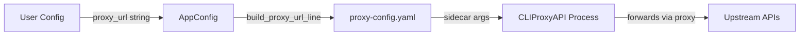
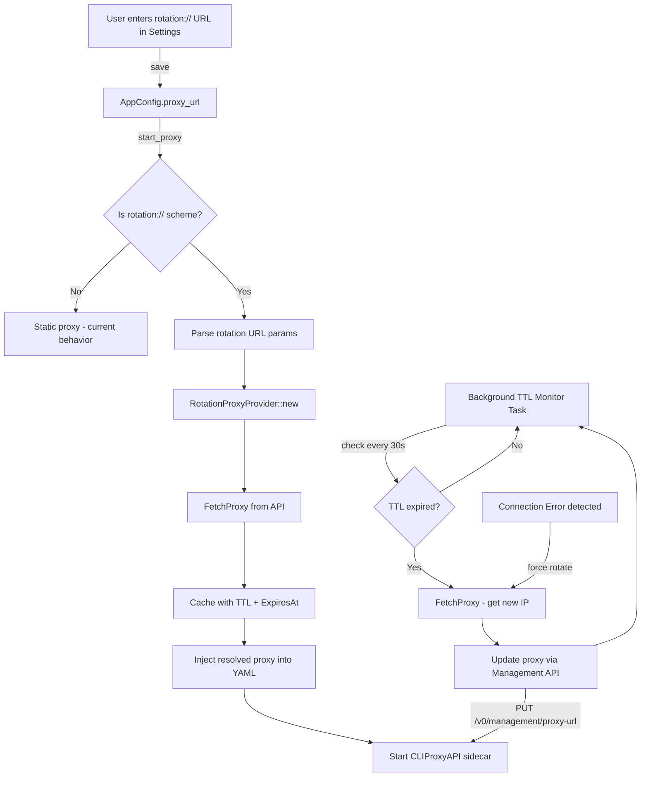

# Implementation Plan: Proxy Rotation (Rotation Proxy)

**Branch**: `feature/proxy-rotation` | **Date**: 2026-02-25 | **Spec**: [Integration Guide](../2026-02-24-proxy-rotation-integration-guide.md)

## Summary

Implement a dynamic proxy rotation mechanism that detects `rotation://` URLs in the proxy configuration, automatically fetches fresh proxy IPs from an external provider API (e.g., proxyxoay.shop), caches them with TTL-based expiration, and seamlessly injects the resolved proxy into the running CLIProxyAPI sidecar. This enables users to bypass rate-limiting and IP bans by cycling through different proxy IPs transparently.

## Technical Context

**Language/Version**: Rust 2021 Edition (Tauri 2.x)  
**Primary Dependencies**: `reqwest` (HTTP client), `tokio` (async runtime), `serde` (serialization), `regex` (TTL parsing)  
**Storage**: In-memory cache (`RwLock<Option<CachedProxy>>`) + AppConfig persistence (config.json)  
**Testing**: `cargo test` (unit tests in Rust)  
**Target Platform**: Windows, macOS, Linux (desktop)  
**Project Type**: Desktop app (Tauri = Rust backend + SolidJS frontend)

## Architecture Analysis

### Current Proxy Flow



**Key observation**: The current system handles proxy as a **static string** set once at config time. The `build_proxy_url_line()` function in [`commands/proxy.rs`](../../../src-tauri/src/commands/proxy.rs:159) resolves the proxy URL (either from system proxy or user config) and writes it into YAML before the sidecar starts.

### Proposed Rotation Proxy Flow



### Integration Points

| Component | File | Change Type |
|-----------|------|-------------|
| Rotation Provider struct | `src-tauri/src/proxy/mod.rs` | **New** - Core rotation logic |
| Rotation types | `src-tauri/src/types/proxy.rs` | **Modify** - Add CachedProxy, RotationConfig types |
| App State | `src-tauri/src/state.rs` | **Modify** - Add rotation provider to shared state |
| Proxy start command | `src-tauri/src/commands/proxy.rs` | **Modify** - Detect rotation://, spawn TTL monitor |
| Config model | `src-tauri/src/config.rs` | **Minimal** - proxy_url already supports any string |
| Frontend settings | `src/components/settings/ProxySettings.tsx` | **Modify** - Add rotation URL help text + status indicator |
| Tauri commands | `src-tauri/src/commands/proxy.rs` | **Modify** - Add rotation status command |

## Design Decisions

### D1: Where does rotation logic live?

**Decision**: In `src-tauri/src/proxy/mod.rs` as a `RotationProxyProvider` struct.

**Rationale**: The `proxy/mod.rs` file is currently empty (placeholder only). It's the natural home for proxy-specific logic. Keeping it separate from commands maintains clean separation of concerns.

### D2: How to update proxy at runtime?

**Decision**: Use CLIProxyAPI's Management API (`PUT /v0/management/proxy-url`) to hot-update the proxy without restarting the sidecar.

**Rationale**: Restarting the sidecar would interrupt active connections. The Management API is already used for other runtime settings (max-retry-interval, usage-statistics, force-model-mappings). If the Management API doesn't support `proxy-url`, fall back to sidecar restart.

**Fallback**: If Management API proxy-url endpoint is unavailable, perform a graceful sidecar restart (stop → update config → start).

### D3: Thread safety for cache

**Decision**: Use `tokio::sync::RwLock<Option<CachedProxy>>` with double-check locking pattern.

**Rationale**: Multiple concurrent requests may try to read the cached proxy. RwLock allows concurrent reads with exclusive writes. The double-check pattern prevents thundering herd (multiple threads fetching simultaneously when cache expires).

### D4: Error handling strategy

**Decision**: 3-tier retry with exponential backoff:
1. **Fetch failure**: Retry up to 3 times with 2s/4s/8s delays
2. **Dead proxy detected**: Force rotation immediately
3. **API quota exhausted**: Log error, emit frontend event, fall back to direct connection (no proxy)

### D5: TTL safety margin

**Decision**: Subtract 30 seconds from reported TTL to pre-emptively rotate before actual expiration.

**Rationale**: Network latency + clock skew could cause requests to fail if we rotate exactly at expiration. The 30s margin is safer than the 5s in the reference implementation.

## Project Structure

### Source Code Changes

```text
src-tauri/src/
├── proxy/
│   └── mod.rs              # RotationProxyProvider (NEW - main logic)
├── types/
│   └── proxy.rs            # CachedProxy, RotationProxyResponse, RotationConfig (MODIFY)
├── state.rs                # Add Option<RotationProxyProvider> to AppState (MODIFY)
├── commands/
│   └── proxy.rs            # Detect rotation://, spawn monitor, add status cmd (MODIFY)
└── config.rs               # No changes needed (proxy_url is already a String)

src/
├── components/
│   └── settings/
│       └── ProxySettings.tsx  # Rotation URL help, status badge (MODIFY)
└── lib/
    └── tauri/
        └── proxy.ts           # Add getRotationStatus() binding (MODIFY)
```

## Risks & Mitigations

| Risk | Impact | Mitigation |
|------|--------|------------|
| CLIProxyAPI lacks proxy-url Management API endpoint | Cannot hot-update → must restart sidecar | Implement restart fallback; active connections will drop briefly |
| Provider API rate-limits or blocks | No proxy available → requests fail | Retry with backoff; fall back to direct connection; notify user |
| TTL parsing fails (unexpected message format) | Cannot determine expiration | Default to conservative TTL (1800s = 30min) |
| Multiple rotation URLs (future) | Not in scope | Design provider as extensible; store as Vec in future |
