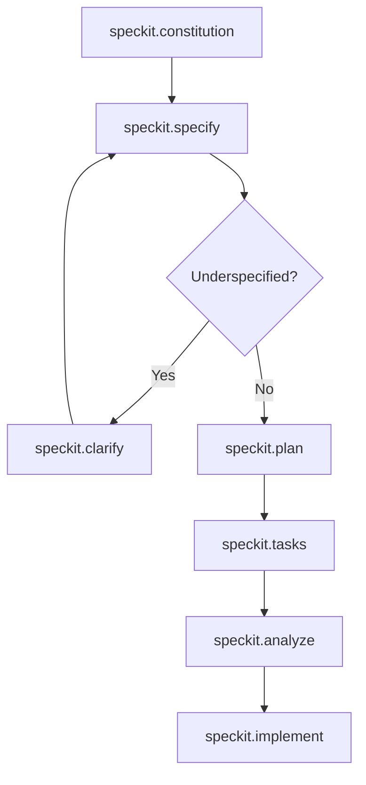

# Implementation Plan: Speckit Adoption Verification

**Feature Branch**: `verification-speckit-adoption`  
**Spec**: [spec.md](./spec.md)  
**Created**: 2026-02-05  
**Status**: Completed

## Technical Context

### Technology Stack
- **Shell**: PowerShell (Windows)
- **File System**: Standard file/directory operations
- **Format**: Markdown for all artifacts

### Dependencies
- None - pure file system verification

### Project Structure
```
project-root/
├── .roo/                          # Roo AI agent configuration
│   ├── commands/                  # Speckit command definitions
│   │   ├── speckit.constitution.md
│   │   ├── speckit.specify.md
│   │   ├── speckit.plan.md
│   │   ├── speckit.tasks.md
│   │   ├── speckit.analyze.md
│   │   ├── speckit.clarify.md
│   │   ├── speckit.implement.md
│   │   ├── speckit.checklist.md
│   │   ├── speckit.taskstoissues.md
│   │   ├── wf1.md
│   │   └── wf2.md
│   ├── rules/                     # Mode-specific rules
│   ├── skills/                    # AI agent skills
│   └── mcp.json                   # MCP server config
├── .specify/                      # Speckit artifacts
│   ├── memory/
│   │   └── constitution.md        # Project constitution
│   ├── templates/                 # Reusable templates
│   │   ├── spec-template.md
│   │   ├── plan-template.md
│   │   ├── tasks-template.md
│   │   ├── checklist-template.md
│   │   └── agent-file-template.md
│   ├── scripts/
│   │   └── powershell/            # Helper scripts
│   │       ├── check-prerequisites.ps1
│   │       ├── common.ps1
│   │       ├── create-new-feature.ps1
│   │       ├── setup-plan.ps1
│   │       └── update-agent-context.ps1
│   └── specs/                     # Feature specifications
│       └── speckit-adoption-verification/
│           ├── spec.md
│           ├── plan.md
│           └── tasks.md
└── ...
```

## Constitution Check

### Applicable Principles
Constitution at `.specify/memory/constitution.md` is currently in template state (unpopulated). No principles to validate against.

### Gate Status
✅ PASS - No blocking principles

## Implementation Phases

### Phase 0: Research (Completed)
- ✅ Identified Speckit as a conceptual workflow system
- ✅ Located all command files in `.roo/commands/`
- ✅ Located all templates in `.specify/templates/`
- ✅ Located all scripts in `.specify/scripts/powershell/`

### Phase 1: Verification (Completed)
- ✅ Confirmed `.specify/` directory exists
- ✅ Confirmed `.roo/` directory exists
- ✅ Confirmed all required subdirectories exist
- ✅ Confirmed all command files present
- ✅ Confirmed all templates present
- ✅ Confirmed all scripts present

### Phase 2: Documentation (Completed)
- ✅ Created spec.md documenting verification results
- ✅ Created plan.md (this file)
- ✅ Will create tasks.md

## Key Findings

### Speckit Command Pipeline


### Workflow Triggers
| Command | Trigger | Flow |
|---------|---------|------|
| `/wf1` | Simple Tasks | Ask → Orchestrator → Code/Debug → Ask |
| `/wf2` | Complex Features | Ask → Architect → Orchestrator → Code/Debug → Ask |

## Artifacts Generated
| Artifact | Path | Status |
|----------|------|--------|
| Specification | `.specify/specs/speckit-adoption-verification/spec.md` | ✅ Created |
| Implementation Plan | `.specify/specs/speckit-adoption-verification/plan.md` | ✅ Created |
| Tasks | `.specify/specs/speckit-adoption-verification/tasks.md` | Pending |

## Conclusion

**Speckit adoption is FULLY VERIFIED**. All required infrastructure components are in place:
- 9 speckit command files
- 2 workflow files
- 5 templates
- 5 PowerShell scripts
- Constitution template ready for population
