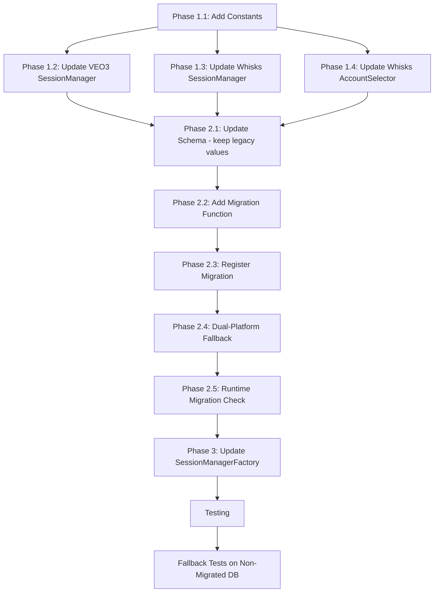

# Implementation Plan: Unified Account Access

**Branch**: `unified-account-access` | **Date**: 2026-02-06 | **Spec**: [unified_account_access_spec.md](./unified_account_access_spec.md)

## Summary

Enable `whisks` to reuse `veo3` accounts by standardizing on `google_labs` platform identifier. This involves:
1. Adding new platform constant
2. Updating Session Managers to accept `google_labs`
3. Updating Account Selector default
4. DB schema migration + data migration

## Technical Context

**Language/Version**: Python 3.11+  
**Primary Dependencies**: SQLite, Pydantic  
**Storage**: SQLite (`account_management` table)  
**Testing**: pytest (integration tests)  
**Project Type**: Monolith (pyBot_modules)  

## Architecture Decision

### Platform Constant Location

**Decision**: Đặt constant tại `pyBot_modules/shared/constants.py`

**Rationale**:
- Shared location cho cả `veo3` và `whisks` modules
- Tránh circular imports
- Single source of truth

```python
# pyBot_modules/shared/constants.py

# Platform identifiers for Google Labs services
PLATFORM_GOOGLE_LABS = "google_labs"

# Legacy alias (deprecated, for backward compatibility during transition)
PLATFORM_VEO3 = "veo3"  # -> Use PLATFORM_GOOGLE_LABS instead
```

## Implementation Phases

### Phase 1: Add Platform Constant & Update Validation

**Files to modify**:

| File | Change |
|------|--------|
| `pyBot_modules/shared/constants.py` | Add `PLATFORM_GOOGLE_LABS = "google_labs"` |
| `pyBot_modules/veo3/services/core/session.py` | Update platform validation (line 435) |
| `pyBot_modules/whisks/services/core/session.py` | Update platform validation (line 271) |
| `pyBot_modules/whisks/services/account_selector.py` | Update default platform (line 24) |

#### 1.1 Create/Update Constants File

```python
# pyBot_modules/shared/constants.py (create if not exists)

"""
Shared constants for pyBot modules.
"""

# Platform identifiers
PLATFORM_GOOGLE_LABS = "google_labs"

# All supported platforms for account_management
SUPPORTED_PLATFORMS = [
    "google_labs",  # VEO3 + Whisks (Google AI Labs)
    "sora",         # OpenAI Sora
    "grok",         # X/Twitter Grok
    "facebook",
    "tiktok",
    "youtube",
    "instagram",
]
```

#### 1.2 Update VEO3 SessionManager

```python
# pyBot_modules/veo3/services/core/session.py (line ~434-438)

# BEFORE:
if account.platform not in (None, "veo3"):
    raise ValueError(
        f"Account {account_id} is not a VEO3 account (platform={account.platform})"
    )

# AFTER:
from pyBot_modules.shared.constants import PLATFORM_GOOGLE_LABS

ALLOWED_PLATFORMS = (None, "veo3", PLATFORM_GOOGLE_LABS)  # "veo3" for backward compat

if account.platform not in ALLOWED_PLATFORMS:
    raise ValueError(
        f"Account {account_id} is not a Google Labs account (platform={account.platform})"
    )
```

#### 1.3 Update Whisks SessionManager

```python
# pyBot_modules/whisks/services/core/session.py (line ~271-274)

# BEFORE:
if account.platform not in (None, "whisks"):
    raise ValueError(
        f"Account {account_id} is not a whisks account (platform={account.platform})"
    )

# AFTER:
from pyBot_modules.shared.constants import PLATFORM_GOOGLE_LABS

ALLOWED_PLATFORMS = (None, "whisks", PLATFORM_GOOGLE_LABS)  # "whisks" for backward compat

if account.platform not in ALLOWED_PLATFORMS:
    raise ValueError(
        f"Account {account_id} is not a Google Labs account (platform={account.platform})"
    )
```

#### 1.4 Update Whisks AccountSelector

```python
# pyBot_modules/whisks/services/account_selector.py (line ~24)

# BEFORE:
def __init__(self, db_path: str, platform: str = "whisks") -> None:

# AFTER:
from pyBot_modules.shared.constants import PLATFORM_GOOGLE_LABS

def __init__(self, db_path: str, platform: str = PLATFORM_GOOGLE_LABS) -> None:
```

---

### Phase 2: Database Migration & Fallback Logic

**Files to modify**:

| File | Change |
|------|--------|
| `pyBot_modules/shared/db/schema.py` | Update platform CHECK constraint (keep whisks + veo3 for backward compat) |
| `pyBot_modules/shared/db/migrations.py` | Add migration function |
| `pyBot_modules/whisks/services/account_selector.py` | Add dual-platform fallback logic |

#### 2.1 Update Schema (Backward Compatible)

```python
# pyBot_modules/shared/db/schema.py (line ~139)

# BEFORE:
platform TEXT NOT NULL CHECK(platform IN ('veo3', 'sora', 'grok', 'facebook', 'tiktok', 'youtube', 'instagram'))

# AFTER:
platform TEXT NOT NULL CHECK(platform IN ('google_labs', 'sora', 'grok', 'facebook', 'tiktok', 'youtube', 'instagram'))
```

#### 2.2 Add Migration Function

```python
# pyBot_modules/shared/db/migrations.py

def migrate_unify_google_labs_platform(db_path: str) -> None:
    """
    Migrate veo3 platform to google_labs for unified account access.
    
    This migration:
    1. Updates platform constraint to include google_labs, remove veo3
    2. Migrates all veo3 accounts to google_labs
    
    Migration Version: v2.3.0 (Unified Account Access)
    Date: 2026-02-06
    
    Args:
        db_path: Path to SQLite database file
    """
    conn = _connect(db_path)
    try:
        cur = conn.cursor()
        
        logger.info("Starting migration: veo3 → google_labs platform unification")
        
        # Step 1: Rename existing table
        cur.execute("ALTER TABLE account_management RENAME TO account_management_old")
        
        # Step 2: Create new table with updated constraint
        from pyBot_modules.shared.db.schema import (
            create_account_management_indexes,
            create_account_management_table,
        )
        create_account_management_table(cur)
        create_account_management_indexes(cur)
        
        # Step 3: Copy data, converting veo3 -> google_labs
        cur.execute("PRAGMA table_info(account_management_old)")
        columns = [row[1] for row in cur.fetchall()]
        
        # Build SELECT with CASE for platform conversion
        cols_list = []
        for col in columns:
            if col == "platform":
                cols_list.append(
                    "CASE WHEN platform = 'veo3' THEN 'google_labs' ELSE platform END"
                )
            else:
                cols_list.append(col)
        
        cols_str = ", ".join(columns)
        select_str = ", ".join(cols_list)
        
        cur.execute(
            f"INSERT INTO account_management ({cols_str}) SELECT {select_str} FROM account_management_old"
        )
        
        # Step 4: Count migrated accounts
        cur.execute(
            "SELECT COUNT(*) FROM account_management WHERE platform = 'google_labs'"
        )
        migrated_count = cur.fetchone()[0]
        
        # Step 5: Drop old table
        cur.execute("DROP TABLE account_management_old")
        
        conn.commit()
        logger.info(
            "Successfully migrated %d accounts from veo3 to google_labs platform",
            migrated_count,
        )
        
    except Exception as e:
        logger.error("Failed to migrate platform unification: %s", e)
        conn.rollback()
        # Restore if needed
        try:
            cur.execute(
                "SELECT name FROM sqlite_master WHERE type='table' AND name='account_management_old'"
            )
            if cur.fetchone():
                cur.execute("DROP TABLE IF EXISTS account_management")
                cur.execute("ALTER TABLE account_management_old RENAME TO account_management")
                conn.commit()
        except:
            pass
        raise
    finally:
        conn.close()
```

#### 2.3 Register Migration

Add to migration list in `migrations.py`:

```python
# In MIGRATIONS list
("migrate_unify_google_labs_platform", migrate_unify_google_labs_platform),
```

#### 2.4 Dual-Platform Fallback in AccountSelector (NEW)

Implement fallback logic để hỗ trợ legacy DBs chưa migrate.

```python
# pyBot_modules/whisks/services/account_selector.py

from pyBot_modules.shared.constants import PLATFORM_GOOGLE_LABS

class AccountSelector:
    """Account selector với dual-platform fallback strategy."""
    
    # Priority order for platform lookup
    PLATFORM_PRIORITY = [PLATFORM_GOOGLE_LABS, "whisks"]
    
    def __init__(self, db_path: str, platform: str = PLATFORM_GOOGLE_LABS) -> None:
        self._platform = platform
        # ...
    
    def refresh(self) -> list[str]:
        """
        Refresh available accounts với dual-platform fallback.
        
        Strategy:
        1. Try primary platform (google_labs)
        2. If empty, fallback to legacy platform (whisks)
        3. Log warning if using fallback (encourage migration)
        """
        accounts = self._fetch_accounts(self._platform)
        
        if not accounts and self._platform == PLATFORM_GOOGLE_LABS:
            # Fallback to legacy 'whisks' platform
            accounts = self._fetch_accounts("whisks")
            if accounts:
                logger.warning(
                    "Using legacy 'whisks' platform accounts. "
                    "Please run migration script: python scripts/migrate_google_labs_accounts.py"
                )
        
        return self._build_labels(accounts)
    
    def _fetch_accounts(self, platform: str) -> list[Account]:
        """Fetch accounts by platform."""
        return self.repo.get_active_accounts(platform=platform)
```

#### 2.5 Runtime Migration Check (NEW)

Thêm startup warning cho legacy platforms.

```python
# pyBot_modules/whisks/services/account_selector.py or __init__.py

def check_legacy_platforms(db_path: str) -> None:
    """
    Runtime check for legacy platform values.
    Logs warning but does NOT block startup.
    """
    conn = sqlite3.connect(db_path)
    try:
        cur = conn.cursor()
        
        # Check for legacy 'whisks' accounts
        cur.execute("SELECT COUNT(*) FROM account_management WHERE platform = 'whisks'")
        whisks_count = cur.fetchone()[0]
        
        # Check for legacy 'veo3' accounts
        cur.execute("SELECT COUNT(*) FROM account_management WHERE platform = 'veo3'")
        veo3_count = cur.fetchone()[0]
        
        if whisks_count > 0 or veo3_count > 0:
            logger.warning(
                "Legacy platform values detected: whisks=%d, veo3=%d. "
                "Run migration: python scripts/migrate_google_labs_accounts.py",
                whisks_count, veo3_count
            )
    finally:
        conn.close()
```

---

### Phase 3: Update SessionManagerFactory (Optional)

**Files to modify**:

| File | Change |
|------|--------|
| `pyBot_modules/shared/browsers/session_manager_factory.py` | Add google_labs routing |

```python
# pyBot_modules/shared/browsers/session_manager_factory.py

# Add after veo3 case (line ~47-51)
elif platform_lower in ("google_labs", "veo3"):  # google_labs maps to VEO3 session manager
    from pyBot_modules.veo3.services.core.session import get_session_manager
    
    logger.debug("Creating Google Labs (VEO3) session manager")
    return await get_session_manager(db_path)
```

---

## Task Breakdown

### Implementation Order



### Checklist

- [ ] **Phase 1: Code Changes**
  - [ ] Create `pyBot_modules/shared/constants.py` với `PLATFORM_GOOGLE_LABS`
  - [ ] Update `pyBot_modules/veo3/services/core/session.py` platform validation
  - [ ] Update `pyBot_modules/whisks/services/core/session.py` platform validation
  - [ ] Update `pyBot_modules/whisks/services/account_selector.py` default platform

- [ ] **Phase 2: Database Migration & Fallback**
  - [ ] Update `pyBot_modules/shared/db/schema.py` CHECK constraint (keep `whisks`, `veo3` for backward compat)
  - [ ] Add `migrate_unify_google_labs_platform()` function
  - [ ] Register migration in MIGRATIONS list
  - [ ] **[NEW]** Implement dual-platform fallback in `AccountSelector.refresh()`
  - [ ] **[NEW]** Add `check_legacy_platforms()` runtime warning function

- [ ] **Phase 3: Integration**
  - [ ] Update `SessionManagerFactory` để route `google_labs`
  - [ ] Add integration test

- [ ] **Testing**
  - [ ] Unit test: VEO3 SessionManager accepts google_labs
  - [ ] Unit test: Whisks SessionManager accepts google_labs
  - [ ] Unit test: Whisks AccountSelector lists google_labs accounts
  - [ ] Integration test: Full workflow với google_labs account
  - [ ] **[NEW]** Integration test: Fallback to `whisks` when `google_labs` empty
  - [ ] **[NEW]** Integration test: Works on non-migrated DB (platform='whisks')
  - [ ] **[NEW]** Integration test: Works on legacy VEO3 DB (platform='veo3')

---

## Verification Criteria

### Pre-Migration Verification

```bash
# Count current veo3 accounts
sqlite3 db/database.db "SELECT COUNT(*) FROM account_management WHERE platform='veo3'"
```

### Post-Migration Verification

```bash
# Verify no veo3 accounts remain
sqlite3 db/database.db "SELECT COUNT(*) FROM account_management WHERE platform='veo3'"
# Should return 0

# Verify google_labs accounts exist
sqlite3 db/database.db "SELECT COUNT(*) FROM account_management WHERE platform='google_labs'"
# Should match pre-migration veo3 count
```

### Smoke Test

```python
# tests/integration/test_unified_account_access.py

import pytest
from pyBot_modules.veo3.services.core.session import SessionManager as VEO3SessionManager
from pyBot_modules.whisks.services.core.session import WhiskSessionManager
from pyBot_modules.whisks.services.account_selector import AccountSelector

@pytest.fixture
def db_path():
    return "db/database.db"

def test_veo3_accepts_google_labs_account(db_path):
    """VEO3 SessionManager should accept google_labs accounts."""
    manager = VEO3SessionManager(db_path)
    # Test với một google_labs account (cần account_id thực)
    # session = await manager.load_session(account_id)
    # assert session is not None

def test_whisks_accepts_google_labs_account(db_path):
    """Whisks SessionManager should accept google_labs accounts."""
    manager = WhiskSessionManager(db_path)
    # Test với một google_labs account
    
def test_whisks_account_selector_lists_google_labs(db_path):
    """Whisks AccountSelector should list google_labs accounts."""
    selector = AccountSelector(db_path)
    labels = selector.refresh()
    # Should include google_labs accounts
    assert len(labels) >= 1  # At least "Tự động (xoay vòng)"


# === NEW: Fallback Tests for Non-Migrated DB ===

def test_whisks_fallback_to_legacy_platform(db_with_whisks_only):
    """
    Whisks AccountSelector should fallback to 'whisks' platform
    when no 'google_labs' accounts exist.
    
    Tests: FR-007 (Dual-Platform Fallback)
    """
    selector = AccountSelector(db_with_whisks_only)
    labels = selector.refresh()
    # Should find legacy 'whisks' accounts via fallback
    assert len(labels) >= 2  # At least rotation + 1 account


def test_veo3_accepts_legacy_veo3_platform(db_with_veo3_only):
    """
    VEO3 SessionManager should accept legacy 'veo3' platform
    without requiring migration.
    
    Tests: FR-008 (VEO3 Legacy Backward Compat)
    """
    manager = VEO3SessionManager(db_with_veo3_only)
    # Verify no error when loading account with platform='veo3'
    # session = await manager.load_session(legacy_veo3_account_id)
    # assert session is not None


def test_runtime_migration_check_logs_warning(db_with_legacy_platforms, caplog):
    """
    Runtime check should log warning when legacy platforms detected.
    
    Tests: FR-009 (Runtime Migration Check)
    """
    from pyBot_modules.whisks.services.account_selector import check_legacy_platforms
    
    check_legacy_platforms(db_with_legacy_platforms)
    
    assert "Legacy platform values detected" in caplog.text
    assert "whisks=" in caplog.text or "veo3=" in caplog.text
```

---

## Rollback Plan

Nếu cần rollback:

```python
def rollback_google_labs_to_veo3(db_path: str) -> None:
    """
    Rollback google_labs platform back to veo3.
    
    WARNING: Only use if migration caused issues.
    """
    conn = sqlite3.connect(db_path)
    try:
        cur = conn.cursor()
        
        # Update platform values
        cur.execute(
            "UPDATE account_management SET platform = 'veo3' WHERE platform = 'google_labs'"
        )
        
        conn.commit()
        logger.info("Rolled back google_labs to veo3 platform")
        
    except Exception as e:
        logger.error("Rollback failed: %s", e)
        conn.rollback()
        raise
    finally:
        conn.close()
```

---

## Risks Identified

| Risk | Mitigation |
|------|------------|
| VEO3 pipeline breaks | Keep backward compat trong SessionManager (accept both veo3 and google_labs) |
| Migration fails mid-way | Atomic transaction với rollback trong migration function |
| Tests fail với hardcoded platform | Update test fixtures để dùng PLATFORM_GOOGLE_LABS constant |
| **[NEW]** Fallback hides migration need | Log warning khi dùng fallback, advise migration trong docs/UI |
| **[NEW]** Mixed platform data confusion | Fallback ưu tiên google_labs, chỉ dùng whisks nếu google_labs empty |
| **[NEW]** Legacy DB chưa migrate fails | Giữ legacy platform values trong CHECK constraint cho backward compat |
