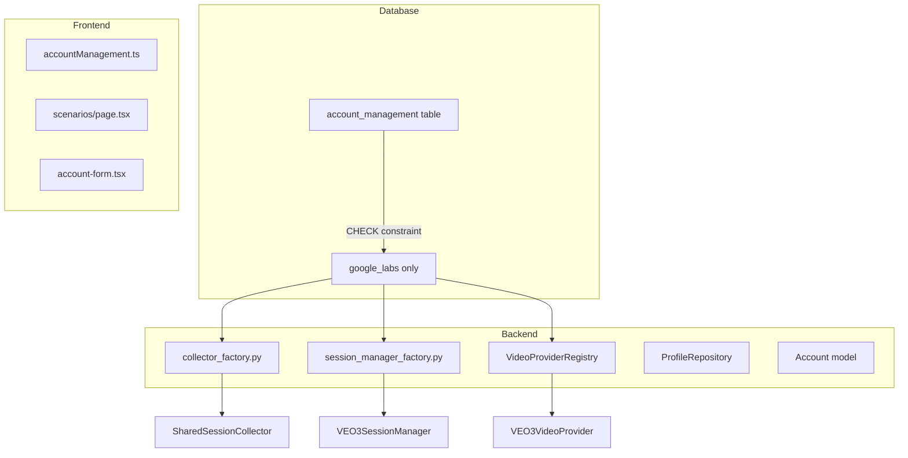

# VEO3 → Google Labs Platform Replacement Spec

> **Version**: 2.4.0  
> **Date**: 2026-02-06  
> **Status**: Draft  

---

## 1. Objective

Completely replace the `'veo3'` platform identifier with `'google_labs'` across the entire codebase (Database, Backend, Frontend).

### 1.1 Motivation

- **Brand consolidation**: Google Labs is the umbrella platform for VEO3 + Whisks
- **DB consistency**: Schema already uses `'google_labs'` in CHECK constraint
- **Future-proofing**: New Google AI features will use same platform identifier

---

## 2. Current State Analysis

### 2.1 Database Schema (✅ Already Updated)

```sql
-- pyBot_modules/shared/db/schema.py:140
platform TEXT NOT NULL CHECK(platform IN ('google_labs', 'sora', 'grok', 'facebook', 'tiktok', 'youtube', 'instagram'))
```

**Status**: Schema already uses `'google_labs'`. No 'veo3' allowed.

### 2.2 Backend - Files to Update

| File | Current | Required Change |
|------|---------|-----------------|
| `pyBot_modules/shared/browsers/collector_factory.py:16,29,44,70` | `"veo3"` | Map `"google_labs"` → VEO3 collector |
| `pyBot_modules/shared/browsers/session_manager_factory.py:47` | `"veo3"` | Map `"google_labs"` → VEO3 session manager |
| `pyBot_modules/shared/video/providers/veo3.py:27,74-76` | `@register("veo3")`, `platform_name="veo3"` | Change to `"google_labs"` |
| `pyBot_modules/shared/db/repositories/profile_repository.py:132,148` | `platform: str = "veo3"` | Change default to `"google_labs"` |
| `pyBot_modules/shared/db/models/account.py:75` | `"platform": "veo3"` example | Change to `"google_labs"` |

### 2.3 Frontend - Files to Update

| File | Current | Required Change |
|------|---------|-----------------|
| `pyBot_web/lib/api/accountManagement.ts:3` | `"veo3"` in AccountPlatform | Replace with `"google_labs"` |
| `pyBot_web/app/[locale]/scenarios/page.tsx:415,431,409,425` | `<SelectItem value="veo3">` | Change to `value="google_labs"` |
| `pyBot_web/components/accounts/account-form.tsx:353` | `<SelectItem value="veo3">` | Change to `value="google_labs"` |

### 2.4 Existing Support (No Changes Needed)

| Component | Status |
|-----------|--------|
| `pyBot_modules/shared/consts.py` | ✅ `PLATFORM_GOOGLE_LABS = "google_labs"` exists |
| `pyBot_modules/shared/db/schema.py` | ✅ CHECK constraint already uses `'google_labs'` |
| `pyBot_modules/whisks/*` | ✅ Already uses `PLATFORM_GOOGLE_LABS` |

---

## 3. Migration Strategy

### 3.1 DB Migration (REQUIRED for existing databases)

Since the schema already excludes `'veo3'` from CHECK constraint, we need a migration to:
1. Update existing records with `platform='veo3'` to `platform='google_labs'`
2. This should already be handled by `migrate_account_management_platform_constraint` in migrations.py

**Verification Query**:
```sql
-- Check no veo3 remains
SELECT COUNT(*) FROM account_management WHERE platform = 'veo3';
-- Should return 0
```

### 3.2 Backend Refactor Strategy

**Pattern**: Map `"google_labs"` → existing VEO3 implementation classes

```python
# Before (collector_factory.py)
if platform_lower == "veo3":
    from pyBot_modules.shared.browsers.collector import SharedSessionCollector
    return SharedSessionCollector()

# After
if platform_lower == "google_labs":
    from pyBot_modules.shared.browsers.collector import SharedSessionCollector
    logger.debug("Creating Google Labs session collector")
    return SharedSessionCollector()
```

### 3.3 Frontend Refactor Strategy

**Pattern**: Replace string literals and display values

```typescript
// Before
type AccountPlatform = "veo3" | "sora" | "grok" | ...

// After  
type AccountPlatform = "google_labs" | "sora" | "grok" | ...
```

```tsx
// Before
<SelectItem value="veo3">VEO3 (Google)</SelectItem>

// After
<SelectItem value="google_labs">Google Labs</SelectItem>
```

---

## 4. Affected Components Summary



---

## 5. Risks & Mitigations

| Risk | Impact | Mitigation |
|------|--------|------------|
| Breaking existing VEO3 accounts | High | Migration script handles data conversion |
| Session invalidation | Medium | Session data tied to account_id, not platform string |
| API compatibility | Low | Platform string is internal, not exposed in external APIs |
| Test failures | Medium | Update test fixtures with new platform value |

---

## 6. Test Cases

### 6.1 Unit Tests

- [ ] `CollectorFactory.create_collector("google_labs")` returns `SharedSessionCollector`
- [ ] `SessionManagerFactory.create_session_manager("google_labs", db_path)` returns VEO3 session manager
- [ ] `VideoProviderRegistry.get("google_labs")` returns `VEO3VideoProvider`
- [ ] `VEO3VideoProvider.platform_name` returns `"google_labs"`

### 6.2 Integration Tests

- [ ] Create account with `platform="google_labs"` → DB insert succeeds
- [ ] List accounts by platform `"google_labs"` → Returns correct results
- [ ] Video generation with google_labs account → Uses VEO3 orchestrator

### 6.3 E2E Tests

- [ ] Frontend account form shows "Google Labs" option
- [ ] Scenarios page shows "Google Labs" in video provider dropdown
- [ ] Creating account via UI with Google Labs platform works

---

## 7. Rollback Plan

If issues found:
1. Revert code changes (git revert)
2. Run reverse migration: `UPDATE account_management SET platform='veo3' WHERE platform='google_labs'`
3. Re-add 'veo3' to schema CHECK constraint

---

## 8. References

- Previous migration: `migrate_account_management_platform_constraint` in `pyBot_modules/shared/db/migrations.py:3405`
- Constant: `PLATFORM_GOOGLE_LABS` in `pyBot_modules/shared/consts.py:5`
- Whisks usage example: `pyBot_modules/whisks/services/account_selector.py:15`
