# Whisks Refactor Execution Plan

## Overview

**Spec Reference:** [whisks_refactor_spec.md](./whisks_refactor_spec.md)

**Objective:** Refactor whisks module để sử dụng centralized Account Management và browser-based token automation.

---

## Phase 1: Core Services Layer

### Task 1.1: Create WhiskSessionData Model
**Files to create:**
- `pyBot_modules/whisks/services/core/__init__.py`
- `pyBot_modules/whisks/services/core/session.py`

**Implementation:**
- [ ] Create `WhiskSessionData` dataclass với fields: account_id, email, access_token, token_expires_at, cookies, headers
- [ ] Implement `is_token_expired()` method với buffer_seconds parameter
- [ ] Implement `needs_refresh()` helper method
- [ ] Port utility functions từ [`veo3/services/core/session.py`](../pyBot_modules/veo3/services/core/session.py):
  - `_parse_datetime()` 
  - `build_cookie_header()`
  - `merge_set_cookie_headers()`

**Verification:**
```bash
python -c "from pyBot_modules.whisks.services.core.session import WhiskSessionData; print('OK')"
```

---

### Task 1.2: Implement WhiskSessionManager
**Files to modify:**
- `pyBot_modules/whisks/services/core/session.py`

**Implementation:**
- [ ] Create `WhiskSessionManager` class
- [ ] Implement `__init__(db_path: str)` với cache và lock
- [ ] Implement `load_session(account_id: str) -> WhiskSessionData`
  - Load từ DB via AccountRepository
  - Parse cookies_json và headers_json
  - Create WhiskSessionData object
- [ ] Implement `save_session(session: WhiskSessionData)` 
  - Update account in DB with new tokens/cookies
- [ ] Implement `get_valid_session(account_id: str) -> WhiskSessionData`
  - Load session
  - Check expiry
  - Trigger refresh if needed
- [ ] Implement `_session_from_account(account: Account) -> WhiskSessionData`

**Verification:**
```python
# Unit test: test_whisks_session_manager.py
async def test_load_session():
    manager = WhiskSessionManager("test.db")
    session = await manager.load_session("test-account-id")
    assert session.account_id == "test-account-id"
```

---

### Task 1.3: Create WhiskSessionCache
**Files to modify:**
- `pyBot_modules/whisks/services/core/session.py`

**Implementation:**
- [ ] Port `SessionCache` class từ veo3/services/core/session.py
- [ ] Customize TTL settings cho Whisks OAuth tokens (default 55 minutes)
- [ ] Implement LRU eviction

---

## Phase 2: Browser Collector Integration

### Task 2.1: Create WhiskBrowserDataCollector
**Files to create:**
- `pyBot_modules/whisks/services/api/__init__.py`
- `pyBot_modules/whisks/services/api/browser_collector.py`

**Implementation:**
- [ ] Create `WhiskBrowserDataCollector` dataclass
- [ ] Define Whisks-specific constants:
  ```python
  TARGET_URL = "https://labs.google.com/search/whisk"
  TOKEN_EXTRACTION_PATTERN = r"Authorization:\s*Bearer\s+(ya29\.[^\s]+)"
  ```
- [ ] Implement `from_profile_id(db_path, profile_id)` factory method
- [ ] Implement `collect(timeout: int = 60) -> Dict[str, Any]`
  - Use BrowserFactory.create_provider(account)
  - Navigate to TARGET_URL
  - Extract cookies via SharedSessionCollector
  - Extract access_token from request interception
- [ ] Implement `_extract_access_token(page)` method

**Dependencies:**
- `pyBot_modules.shared.browsers.factory.BrowserFactory`
- `pyBot_modules.shared.browsers.collectors.SharedSessionCollector`

**Verification:**
```python
# Integration test (requires profile setup)
collector = WhiskBrowserDataCollector.from_profile_id(db_path, "test-profile-id")
result = await collector.collect(timeout=30)
assert result["success"] is True
assert "access_token" in result
```

---

### Task 2.2: Token Extraction Strategy
**Files to modify:**
- `pyBot_modules/whisks/services/api/browser_collector.py`

**Implementation:**
- [ ] Intercept network requests to `aisandbox-pa.googleapis.com`
- [ ] Extract `Authorization: Bearer ya29.xxx` header
- [ ] Parse token expiry từ response hoặc estimate (60 minutes default)
- [ ] Handle Google OAuth redirect flow

**Special Considerations:**
- Whisks API uses direct Bearer token in request header
- Token format: `ya29.xxx` (Google OAuth access token)
- Token typically valid for 60 minutes

---

### Task 2.3: Session Refresh Service
**Files to create:**
- `pyBot_modules/whisks/services/core/session_refresh.py`

**Implementation:**
- [ ] Create `WhiskSessionRefreshService` class
- [ ] Implement `refresh_session(account_id: str) -> WhiskSessionData`
  - Get account from DB
  - Launch browser via BrowserFactory
  - Navigate to Whisks page
  - Extract new cookies and token
  - Update DB and return new session
- [ ] Implement retry logic với exponential backoff
- [ ] Handle common errors: ProfileNotFound, BrowserLaunchFailed, TokenExtractionFailed

---

## Phase 3: Client Layer Updates

### Task 3.1: Update WhiskClient
**Files to modify:**
- `pyBot_modules/whisks/clients/whisk_client.py`

**Implementation:**
- [ ] Add session-based method signature:
  ```python
  async def generate_image_with_session(
      self, 
      prompt: str, 
      workflow_id: str,
      aspect_ratio: WhiskAspectRatio,
      seed: Optional[int],
      session: WhiskSessionData,  # NEW
      image_model: WhiskImageModel = WhiskImageModel.IMAGEN_3_5,
  ) -> Tuple[List[bytes], int]:
  ```
- [ ] Extract token from session: `session.access_token`
- [ ] Add session headers: `{**session.headers, "Authorization": f"Bearer {token}"}`
- [ ] Deprecate old `generate_image(..., token: str)` method với warning

**Verification:**
```python
# Unit test
async def test_generate_with_session():
    client = WhiskClient()
    session = WhiskSessionData(account_id="test", email="test@gmail.com", access_token="ya29.xxx")
    # Mock HTTP response
    result = await client.generate_image_with_session(prompt="test", ..., session=session)
```

---

### Task 3.2: Update ImageService
**Files to modify:**
- `pyBot_modules/whisks/services/image_service.py`

**Implementation:**
- [ ] Change constructor to accept `db_path` instead of `TokenService`
- [ ] Add `WhiskSessionManager` dependency
- [ ] Add `AccountRepository` for account rotation
- [ ] Implement account selection logic:
  ```python
  async def _get_next_account(self) -> Account:
      """Get next active whisks account for rotation."""
      accounts = self._account_repo.get_active_accounts(platform="whisks")
      if not accounts:
          raise NoAccountsAvailable("whisks")
      # Simple round-robin or least-recently-used
      return accounts[self._rotation_index % len(accounts)]
  ```
- [ ] Update `generate()` method to use session instead of token string

---

## Phase 4: Configuration Updates

### Task 4.1: Update Global Config
**Files to modify:**
- `pyBot_modules/whisks/config/settings.py`
- `pyBot_modules/whisks/models.py`

**Implementation:**
- [ ] Remove `tokens` field from `WhiskGlobalConfig`
- [ ] Remove `WhiskToken` model (deprecated)
- [ ] Keep only: `default_aspect`, `workflow_id`
- [ ] Add deprecation warning for old config format

**New Config Schema:**
```python
class WhiskGlobalConfig(BaseModel):
    default_aspect: WhiskAspectRatio = WhiskAspectRatio.LANDSCAPE
    workflow_id: str = ""
    # REMOVED: tokens: List[WhiskToken]
    # REMOVED: next_token_index: int
```

---

### Task 4.2: Deprecate TokenService
**Files to modify:**
- `pyBot_modules/whisks/services/token_service.py`

**Implementation:**
- [ ] Add deprecation warning on import
- [ ] Add deprecation warning on method calls
- [ ] Update docstring với migration guide
- [ ] Keep class for backward compatibility during transition

```python
import warnings

class TokenService:
    """
    DEPRECATED: Use WhiskSessionManager instead.
    
    Migration:
        # Old way (deprecated)
        token_service = TokenService()
        name, token = token_service.get_token()
        
        # New way
        session_manager = WhiskSessionManager(db_path)
        session = await session_manager.get_valid_session(account_id)
        token = session.access_token
    """
    
    def __init__(self, *args, **kwargs):
        warnings.warn(
            "TokenService is deprecated. Use WhiskSessionManager instead.",
            DeprecationWarning,
            stacklevel=2
        )
        # ... existing init
```

---

## Phase 5: GUI Updates

### Task 5.1: Remove Token Pool UI
**Files to modify:**
- `pyBot_modules/whisks/main.py`

**Implementation:**
- [ ] Remove Token Pool card từ Settings tab
- [ ] Remove `TokenPool` class usage
- [ ] Remove token-related UI callbacks: `_on_add_token`, `_on_remove_token`
- [ ] Keep WORKFLOW_ID và DEFAULT_ASPECT settings

**Lines to modify:**
- Remove lines 38-138 (TokenPool class)
- Remove lines 1274-1350 (Token Pool UI in Settings)

---

### Task 5.2: Add Account Selector
**Files to modify:**
- `pyBot_modules/whisks/main.py`

**Implementation:**
- [ ] Add Account Dropdown in Settings tab:
  ```python
  # Account selector
  ctk.CTkLabel(card_account, text="Chọn Account (từ Database)")
  self.account_dropdown = ctk.CTkComboBox(
      card_account,
      values=self._get_account_names(),
      command=self._on_account_selected
  )
  ```
- [ ] Implement `_get_account_names()`:
  ```python
  def _get_account_names(self) -> List[str]:
      accounts = AccountRepository(self.db_path).get_active_accounts(platform="whisks")
      return [f"{a.email} ({a.id[:8]})" for a in accounts]
  ```
- [ ] Add "Refresh Token" button để trigger browser collection
- [ ] Add account status indicator (valid/expired)

---

### Task 5.3: Add Account Management Link
**Files to modify:**
- `pyBot_modules/whisks/main.py`

**Implementation:**
- [ ] Add button "Quản lý Accounts" link đến Admin UI
- [ ] Show current account count và status summary
- [ ] Add tooltip explaining DB-based account management

---

## Phase 6: Testing & Validation

### Task 6.1: Unit Tests
**Files to create:**
- `pyBot_modules/whisks/tests/__init__.py`
- `pyBot_modules/whisks/tests/test_session.py`
- `pyBot_modules/whisks/tests/test_image_service.py`

**Test Cases:**
- [ ] `test_session_data_creation`
- [ ] `test_token_expiry_check`
- [ ] `test_session_manager_load`
- [ ] `test_session_manager_cache`
- [ ] `test_image_service_with_session`
- [ ] `test_account_rotation`

---

### Task 6.2: Integration Tests
**Files to create:**
- `pyBot_modules/whisks/tests/test_browser_collector.py`
- `pyBot_modules/whisks/tests/test_e2e.py`

**Test Cases:**
- [ ] `test_browser_collector_with_profile` (requires real profile)
- [ ] `test_full_image_generation_flow`
- [ ] `test_token_refresh_on_expiry`

---

### Task 6.3: Migration Tests
**Files to create:**
- `pyBot_modules/whisks/tests/test_migration.py`

**Test Cases:**
- [ ] `test_old_config_loads_without_crash`
- [ ] `test_deprecation_warning_shown`
- [ ] `test_gui_without_token_pool`

---

## Phase 7: Documentation & Cleanup

### Task 7.1: Update Module Documentation
**Files to modify:**
- `pyBot_modules/whisks/README.md` (create if not exists)

**Content:**
- [ ] Architecture overview with new components
- [ ] Setup instructions for DB-based accounts
- [ ] Migration guide from TokenPool
- [ ] Troubleshooting common issues

---

### Task 7.2: Update __init__.py Exports
**Files to modify:**
- `pyBot_modules/whisks/__init__.py`
- `pyBot_modules/whisks/services/__init__.py`

**Implementation:**
- [ ] Export new classes: `WhiskSessionManager`, `WhiskSessionData`, `WhiskBrowserDataCollector`
- [ ] Mark deprecated exports: `TokenService`

---

### Task 7.3: Code Cleanup
**Files to modify:**
- Various

**Implementation:**
- [ ] Remove dead code từ main.py (old TokenPool references)
- [ ] Remove unused imports
- [ ] Update type hints
- [ ] Run linter và fix warnings

---

## Execution Order Summary

```mermaid
gantt
    title Whisks Refactor Execution Timeline
    dateFormat X
    axisFormat %s
    
    section Phase 1
    Task 1.1 SessionData Model     :p1t1, 0, 1
    Task 1.2 SessionManager        :p1t2, after p1t1, 2
    Task 1.3 SessionCache          :p1t3, after p1t2, 1
    
    section Phase 2
    Task 2.1 BrowserDataCollector  :p2t1, after p1t3, 2
    Task 2.2 Token Extraction      :p2t2, after p2t1, 1
    Task 2.3 Session Refresh       :p2t3, after p2t2, 1
    
    section Phase 3
    Task 3.1 Update WhiskClient    :p3t1, after p2t3, 1
    Task 3.2 Update ImageService   :p3t2, after p3t1, 1
    
    section Phase 4
    Task 4.1 Update Global Config  :p4t1, after p3t2, 1
    Task 4.2 Deprecate TokenService:p4t2, after p4t1, 1
    
    section Phase 5
    Task 5.1 Remove Token Pool UI  :p5t1, after p4t2, 1
    Task 5.2 Add Account Selector  :p5t2, after p5t1, 1
    Task 5.3 Account Mgmt Link     :p5t3, after p5t2, 1
    
    section Phase 6
    Task 6.1 Unit Tests            :p6t1, after p5t3, 1
    Task 6.2 Integration Tests     :p6t2, after p6t1, 1
    Task 6.3 Migration Tests       :p6t3, after p6t2, 1
    
    section Phase 7
    Task 7.1 Documentation         :p7t1, after p6t3, 1
    Task 7.2 Update Exports        :p7t2, after p7t1, 1
    Task 7.3 Code Cleanup          :p7t3, after p7t2, 1
```



---

## Dependencies Graph

```mermaid
graph LR
    subgraph Phase1[Phase 1: Core]
        T1_1[1.1 SessionData]
        T1_2[1.2 SessionManager]
        T1_3[1.3 SessionCache]
    end
    
    subgraph Phase2[Phase 2: Browser]
        T2_1[2.1 BrowserCollector]
        T2_2[2.2 Token Extraction]
        T2_3[2.3 Session Refresh]
    end
    
    subgraph Phase3[Phase 3: Client]
        T3_1[3.1 WhiskClient]
        T3_2[3.2 ImageService]
    end
    
    subgraph Phase4[Phase 4: Config]
        T4_1[4.1 Global Config]
        T4_2[4.2 Deprecate Token]
    end
    
    subgraph Phase5[Phase 5: GUI]
        T5_1[5.1 Remove TokenPool]
        T5_2[5.2 Account Selector]
        T5_3[5.3 Mgmt Link]
    end
    
    T1_1 --> T1_2
    T1_2 --> T1_3
    T1_3 --> T2_1
    T2_1 --> T2_2
    T2_2 --> T2_3
    T1_2 --> T2_3
    T2_3 --> T3_1
    T1_2 --> T3_2
    T3_1 --> T3_2
    T3_2 --> T4_1
    T4_1 --> T4_2
    T4_2 --> T5_1
    T5_1 --> T5_2
    T5_2 --> T5_3
```



---

## Rollback Plan

Nếu cần rollback:

1. **Feature Flag Disable:**
   ```bash
   export WHISKS_USE_DB_ACCOUNTS=false
   ```

2. **Git Revert:**
   ```bash
   git revert <commit-range>
   ```

3. **Database Cleanup:**
   ```sql
   -- Remove test accounts (if any)
   DELETE FROM account_management WHERE platform = 'whisks' AND email LIKE '%test%';
   ```

---

## Completion Checklist

- [ ] All Phase 1 tasks completed
- [ ] All Phase 2 tasks completed
- [ ] All Phase 3 tasks completed
- [ ] All Phase 4 tasks completed
- [ ] All Phase 5 tasks completed
- [ ] All Phase 6 tests passing
- [ ] All Phase 7 documentation updated
- [ ] Code review completed
- [ ] No deprecation warnings in production code
- [ ] Manual testing on development environment
- [ ] Ready for production deployment
