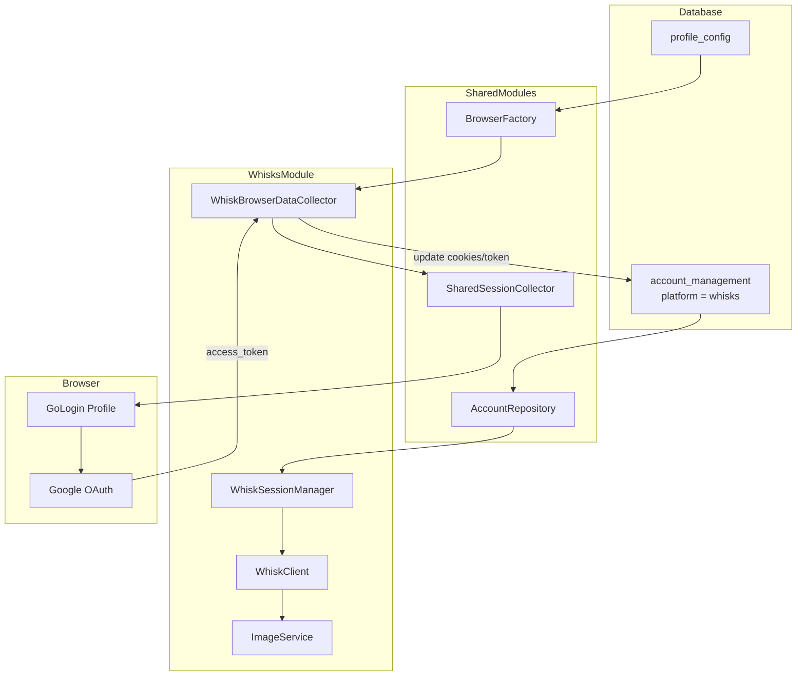

# Whisks Refactor Specification

## 1. Overview

### 1.1 Feature Summary
Refactor `whisks` module để sử dụng Account Management chung (Database) và tự động lấy token từ Browser Profile (SessionManager) giống như `veo3`.

### 1.2 Current State Analysis

#### Whisks Architecture (AS-IS)
```
pyBot_modules/whisks/
├── main.py              # GUI + TokenPool (static list)
├── models.py            # WhiskToken, WhiskGlobalConfig
├── clients/
│   ├── whisk_client.py  # HTTP client, cần token manual
│   └── http.py
├── services/
│   ├── token_service.py # Round-robin từ global_config.json
│   └── image_service.py
├── config/
│   └── settings.py      # Load/save global_config.json
└── utils/
```

**Vấn đề chính:**
- `TokenPool` class trong [`main.py:38-138`](pyBot_modules/whisks/main.py:38) lưu token tĩnh từ file JSON
- Token phải copy thủ công từ browser DevTools
- Không tích hợp với `shared.db` Account Management
- Không có browser automation để refresh token tự động

#### VEO3 Architecture (Reference Pattern)
```
pyBot_modules/veo3/
├── services/
│   ├── core/
│   │   ├── session.py       # SessionManager, SessionData, token validation
│   │   └── session_refresh.py
│   └── api/
│       └── browser_collector.py  # Auto-collect cookies/tokens
├── automation/
│   └── browser_automation.py
└── clients/
    └── auth.py
```

### 1.3 Goals
1. **Bỏ TokenPool static** - Thay bằng `shared.db` Account Management
2. **SessionManager cho whisks** - Port pattern từ veo3
3. **Browser Collector** - Tự động lấy Google OAuth token
4. **Tái sử dụng Google Login** - Xem xét shared logic với veo3

---

## 2. Target Architecture

### 2.1 Directory Structure (TO-BE)
```
pyBot_modules/whisks/
├── main.py              # GUI (updated: bỏ TokenPool, dùng AccountSelector)
├── models.py            # Updated: bỏ WhiskToken from global config
├── clients/
│   ├── whisk_client.py  # Updated: nhận session thay vì token string
│   └── http.py
├── services/
│   ├── __init__.py
│   ├── token_service.py   # DEPRECATED → thay bằng session.py
│   ├── image_service.py   # Updated: dùng SessionManager
│   └── core/              # NEW
│   │   ├── __init__.py
│   │   ├── session.py     # WhiskSessionManager, WhiskSessionData
│   │   └── session_refresh.py
│   └── api/               # NEW
│       ├── __init__.py
│       └── browser_collector.py  # WhiskBrowserDataCollector
├── config/
│   └── settings.py      # Updated: bỏ TOKENS từ global config
└── utils/
```

### 2.2 Data Flow Diagram



### 2.3 Account Platform Decision

**Recommendation: Tách biệt `platform='whisks'`**

| Criteria | Merge với veo3 | Tách whisks |
|----------|----------------|-------------|
| Domain separation | ❌ Khó quản lý quota riêng | ✅ Dễ tracking |
| Account reuse | ✅ Cùng Google account | ✅ Có thể link profile_id |
| Token scope | ❌ Whisks cần scope khác | ✅ Scope riêng |
| Error isolation | ❌ Rate limit ảnh hưởng chéo | ✅ Isolated |

**Decision:** Sử dụng `platform='whisks'` riêng, nhưng có thể dùng chung `profile_id` với veo3 nếu cùng Google account.

---

## 3. Technical Specifications

### 3.1 WhiskSessionData

```python
@dataclass
class WhiskSessionData:
    """Session data for Whisks API authentication."""
    
    account_id: str
    email: str
    access_token: str  # ya29.xxx format
    token_expires_at: Optional[datetime] = None
    cookies: Dict[str, str] = field(default_factory=dict)
    headers: Dict[str, str] = field(default_factory=dict)
    proxy: Optional[Dict[str, Any]] = None
    created_at: datetime = field(default_factory=lambda: datetime.now(timezone.utc))
    
    def is_token_expired(self, buffer_seconds: int = 300) -> bool:
        """Check if token needs refresh."""
        if not self.token_expires_at:
            return True  # Conservative: refresh if unknown
        now = datetime.now(timezone.utc)
        return now >= (self.token_expires_at - timedelta(seconds=buffer_seconds))
```

### 3.2 WhiskSessionManager

```python
class WhiskSessionManager:
    """Manages whisks sessions with caching and refresh."""
    
    def __init__(self, db_path: str):
        self._db_path = db_path
        self._cache: Dict[str, WhiskSessionData] = {}
        self._lock = asyncio.Lock()
    
    async def load_session(self, account_id: str) -> WhiskSessionData:
        """Load session from cache or database."""
        
    async def refresh_session(self, account_id: str) -> WhiskSessionData:
        """Refresh token via browser automation."""
        
    async def get_valid_session(self, account_id: str) -> WhiskSessionData:
        """Get session, refreshing if needed."""
```

### 3.3 WhiskBrowserDataCollector

Tái sử dụng `SharedSessionCollector` với Whisks-specific configuration:

```python
@dataclass
class WhiskBrowserDataCollector:
    """Collect Whisks OAuth tokens via browser automation."""
    
    db_path: str
    account_id: str
    
    # Whisks-specific URLs
    TARGET_URL = "https://labs.google.com/search/whisk"
    LOGIN_URL = "https://accounts.google.com"
    
    @classmethod
    def from_profile_id(cls, db_path: str, profile_id: str) -> "WhiskBrowserDataCollector":
        """Factory from profile_id."""
    
    async def collect(self, timeout: int = 60) -> Dict[str, Any]:
        """Collect cookies and access_token."""
```

### 3.4 Account Schema Requirements

Sử dụng `account_management` table với:

| Field | Type | Description |
|-------|------|-------------|
| id | TEXT PRIMARY KEY | Unique account ID |
| platform | TEXT | `"whisks"` |
| email | TEXT | Google email |
| profile_id | TEXT | FK to profile_config |
| access_token | TEXT | `ya29.xxx` OAuth token |
| token_expires_at | INTEGER | Unix timestamp |
| cookies_json | TEXT | Browser cookies |
| headers_json | TEXT | Request headers |
| status | TEXT | active/inactive/error |

### 3.5 Shared Google Login Logic

**Đánh giá khả năng tái sử dụng:**

| Component | VEO3 | Whisks | Reusable? |
|-----------|------|--------|-----------|
| GoLogin profile launch | ✅ | ✅ | ✅ Yes |
| Google OAuth flow | ✅ | ✅ | ✅ Yes (same flow) |
| Cookie extraction | ✅ | ✅ | ✅ Yes |
| Token extraction | Từ response headers | Từ Authorization header | ⚠️ Partial |
| Target URL | labs.google/fx | labs.google/whisk | ❌ Different |

**Recommendation:** 
- Tái sử dụng `BrowserFactory` + `SharedSessionCollector`
- Customize `target_url` và token extraction logic cho Whisks

---

## 4. API Changes

### 4.1 WhiskClient Updates

**Before:**
```python
async def generate_image(self, prompt: str, ..., token: str):
    headers = {"Authorization": f"Bearer {token}"}
```

**After:**
```python
async def generate_image(self, prompt: str, ..., session: WhiskSessionData):
    if session.is_token_expired():
        raise TokenExpiredError(session.account_id)
    headers = {
        "Authorization": f"Bearer {session.access_token}",
        **session.headers
    }
```

### 4.2 ImageService Updates

**Before:**
```python
def __init__(self, token_service: TokenService):
    self._token_service = token_service

async def generate(self, request):
    name, token = self._token_service.get_token()
    return await self._client.generate_image(..., token=token)
```

**After:**
```python
def __init__(self, db_path: str):
    self._session_manager = WhiskSessionManager(db_path)
    self._account_repo = AccountRepository(db_path)

async def generate(self, request, account_id: str = None):
    if not account_id:
        account = self._get_next_account()
        account_id = account.id
    session = await self._session_manager.get_valid_session(account_id)
    return await self._client.generate_image(..., session=session)
```

---

## 5. Migration Strategy

### 5.1 Backward Compatibility
- Keep `global_config.json` for non-token settings (WORKFLOW_ID, DEFAULT_ASPECT)
- Deprecate `TOKENS` field in global config
- GUI shows migration prompt if old tokens exist

### 5.2 Data Migration
1. Không migrate token từ JSON → DB (tokens expire nhanh)
2. User cần re-login với browser profile
3. Tạo accounts mới trong DB với platform='whisks'

### 5.3 Feature Flag
```python
# Feature flag during transition
WHISKS_USE_DB_ACCOUNTS = os.getenv("WHISKS_USE_DB_ACCOUNTS", "false") == "true"
```

---

## 6. Risks & Mitigations

| Risk | Impact | Mitigation |
|------|--------|------------|
| Whisks API thay đổi endpoint | High | Abstract API calls, easy to update |
| Token extraction khác VEO3 | Medium | Custom token extractor, test thoroughly |
| Browser profile không có Whisks login | Medium | Clear error message, login instructions |
| Rate limiting trên shared accounts | Low | Platform separation đã giải quyết |

---

## 7. Success Criteria

1. ✅ Whisks accounts stored in `account_management` table
2. ✅ Token auto-refresh via browser automation
3. ✅ No manual token copy from DevTools
4. ✅ GUI updated to use Account Selector
5. ✅ Backward compatible with existing workflows
6. ✅ Unit tests for SessionManager
7. ✅ Integration test for BrowserCollector

---

## 8. Out of Scope

- Merge whisks và veo3 accounts (future consideration)
- Multi-browser support (only GoLogin initially)
- Rate limiting logic (existing whisks has basic retry)
- Whisk Video generation (image only for now)
