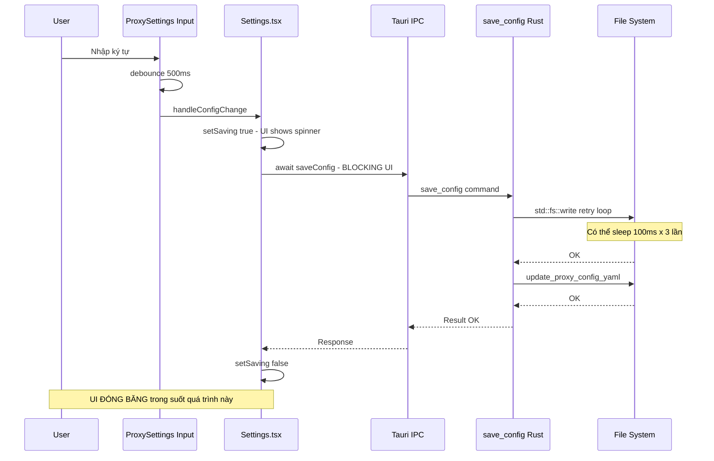
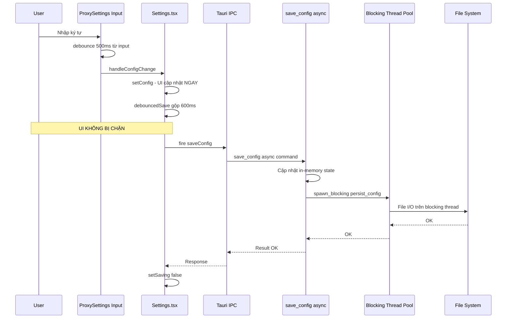
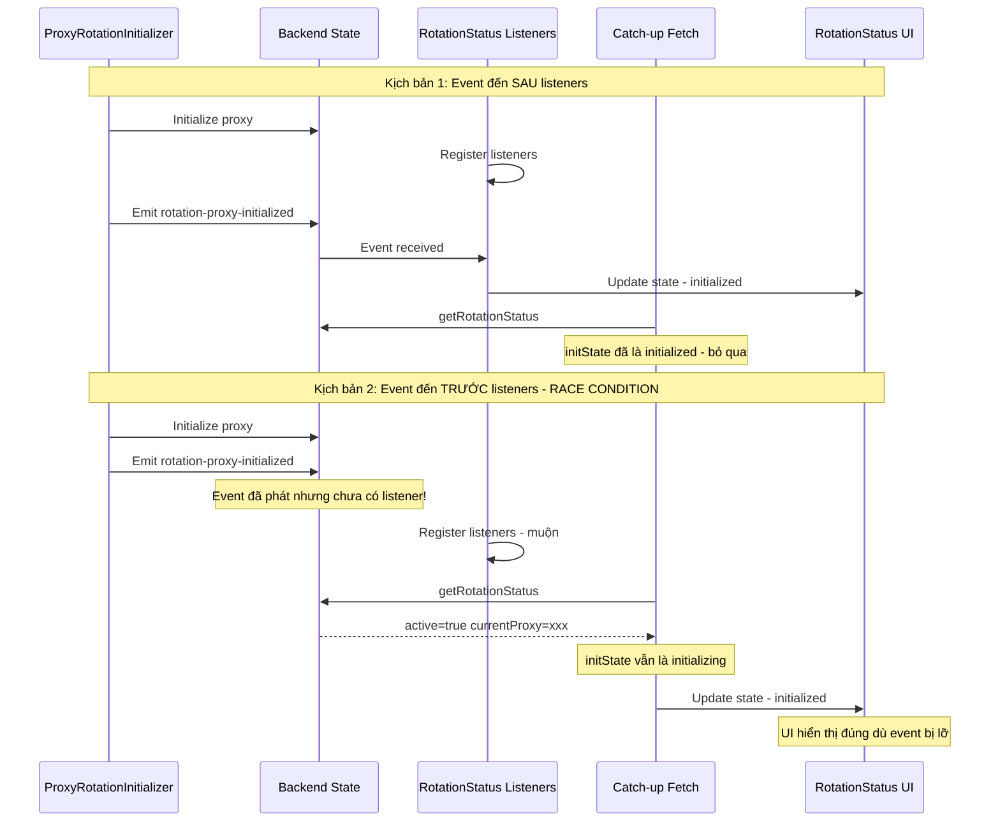

# Proxy Fix Architecture — 3 Vấn Đề Cốt Lõi

## Mục tiêu

Tài liệu giải pháp kỹ thuật cho 3 vấn đề trong ProxyPal (SolidJS + Tauri/Rust):
1. UI đóng băng khi auto-save cấu hình proxy
2. Race condition giữa proxy initializer và RotationStatus component
3. Hiển thị IP hiện tại trong RotationStatus.tsx

---

## Vấn đề 1: Thắt cổ chai luồng UI khi lưu cấu hình

### Nguyên nhân gốc rễ

**Chuỗi blocking đồng bộ từ Frontend → Backend:**

```
User nhập liệu → debounce 500ms → handleConfigChange()
  → await saveConfig(newConfig)         // Frontend chờ IPC response
    → invoke("save_config")             // Tauri IPC call
      → persist_config()                // Rust sync
        → save_config_to_file()         // std::fs::write + retry loop
          → std::thread::sleep(100ms)   // BLOCKING! lên đến 3 lần
        → update_proxy_config_yaml()    // thêm file I/O
      → state.config.lock().unwrap()    // Mutex lock
```

**Vấn đề cụ thể nằm ở 3 điểm:**

1. **`save_config_to_path()`** trong [`src-tauri/src/config.rs:318`](src-tauri/src/config.rs:318) sử dụng `std::fs::write` + retry loop với `std::thread::sleep(100ms)` — blocking I/O trên Tauri command thread.

2. **`handleConfigChange()`** trong [`src/pages/Settings.tsx:356`](src/pages/Settings.tsx:356) là `async` nhưng **await trực tiếp** kết quả IPC, khiến signal `setSaving(true)` kích hoạt re-render toàn bộ tree trong khi chờ I/O.

3. **Debounce chỉ ở tầng input**, không ở tầng save: Mỗi lần `handleConfigChange` được gọi, nó tạo một IPC call mới. Nếu nhiều field thay đổi nhanh, nhiều save chạy đồng thời → contention trên Mutex `state.config`.

### Luồng xử lý hiện tại (có vấn đề)



### Giải pháp đề xuất

**Chiến lược: Fire-and-forget + Debounce tập trung + Backend async I/O**

#### A. Frontend: Debounced fire-and-forget save

**File cần sửa:** [`src/pages/Settings.tsx`](src/pages/Settings.tsx)

```tsx
// TRƯỚC: Blocking await
const handleConfigChange = async (
  key: keyof ReturnType<typeof config>,
  value: boolean | number | string,
) => {
  const newConfig = { ...config(), [key]: value };
  setConfig(newConfig);
  setSaving(true);
  try {
    await saveConfig(newConfig); // ← BLOCKING UI
    toastStore.success(t("settings.toasts.settingsSaved"));
  } catch (error) {
    toastStore.error(...);
  } finally {
    setSaving(false);
  }
};

// SAU: Fire-and-forget với debounce tập trung
let saveTimer: number | undefined;
let pendingConfig: AppConfig | null = null;
let saveAbortController: AbortController | null = null;

const debouncedSave = (newConfig: AppConfig) => {
  pendingConfig = newConfig;
  if (saveTimer) clearTimeout(saveTimer);

  saveTimer = window.setTimeout(async () => {
    const configToSave = pendingConfig;
    if (!configToSave) return;
    pendingConfig = null;

    setSaving(true);
    try {
      await saveConfig(configToSave);
      // Chỉ show success nếu không có pending save mới
      if (!pendingConfig) {
        toastStore.success(t("settings.toasts.settingsSaved"));
      }
    } catch (error) {
      console.error("Failed to save config:", error);
      toastStore.error(t("settings.toasts.settingsSaveFailed"), String(error));
    } finally {
      if (!pendingConfig) {
        setSaving(false);
      }
    }
  }, 600); // 600ms debounce — gộp nhiều thay đổi
};

const handleConfigChange = (
  key: keyof ReturnType<typeof config>,
  value: boolean | number | string,
) => {
  const newConfig = { ...config(), [key]: value };
  setConfig(newConfig); // Cập nhật UI NGAY LẬP TỨC

  // Xử lý đặc biệt cho management key (cần restart proxy)
  if (key === "managementKey" && appStore.proxyStatus().running) {
    // Trường hợp đặc biệt: cần await vì phải restart proxy
    void (async () => {
      setSaving(true);
      try {
        await saveConfig(newConfig);
        toastStore.info(t("settings.toasts.restartingProxyForManagementKey"));
        await stopProxy();
        await new Promise((r) => setTimeout(r, 500));
        await startProxy();
        toastStore.success(t("settings.toasts.proxyRestartedWithManagementKey"));
      } catch (error) {
        toastStore.error(t("settings.toasts.settingsSaveFailed"), String(error));
      } finally {
        setSaving(false);
      }
    })();
    return;
  }

  // Debounced save cho các trường hợp bình thường
  debouncedSave(newConfig);
};

// Cleanup
onCleanup(() => {
  if (saveTimer) clearTimeout(saveTimer);
  // Flush pending save nếu có
  if (pendingConfig) {
    void saveConfig(pendingConfig);
  }
});
```

**Điểm quan trọng:**
- `setConfig(newConfig)` cập nhật reactive state **ngay lập tức** → UI luôn phản ánh giá trị mới nhất
- `debouncedSave` gộp nhiều thay đổi liên tiếp thành 1 IPC call
- `setSaving` không chặn tương tác UI, chỉ hiển thị indicator nhỏ
- `onCleanup` flush pending save khi component unmount để tránh mất data

#### B. Backend: Async file I/O với spawn_blocking

**File cần sửa:** [`src-tauri/src/commands/config.rs`](src-tauri/src/commands/config.rs)

```rust
// TRƯỚC: Synchronous command
#[tauri::command]
pub fn save_config(state: State<AppState>, mut config: AppConfig) -> Result<(), String> {
    // ... decode, persist, lock — tất cả đồng bộ
    persist_config(&config)?; // ← Blocking file I/O
    let mut current_config = state.config.lock().unwrap();
    *current_config = config;
    Ok(())
}

// SAU: Async command + spawn_blocking cho file I/O
#[tauri::command]
pub async fn save_config(state: State<'_, AppState>, mut config: AppConfig) -> Result<(), String> {
    // Decode proxy_url (nhẹ, giữ trên async thread)
    if let Ok(decoded) = urlencoding::decode(&config.proxy_url) {
        config.proxy_url = decoded.into_owned();
    }

    // Cập nhật in-memory state TRƯỚC (nhanh, non-blocking)
    {
        let mut current_config = state.config.lock().unwrap();
        *current_config = config.clone();
    }

    // Đẩy file I/O xuống blocking thread pool
    let config_for_io = config.clone();
    tokio::task::spawn_blocking(move || {
        persist_config(&config_for_io)
    })
    .await
    .map_err(|e| format!("Task join error: {}", e))?
}
```

**File cần sửa:** [`src-tauri/src/config.rs`](src-tauri/src/config.rs) — cải thiện retry logic

```rust
// TRƯỚC: sleep blocking thread
pub(crate) fn save_config_to_path(path: &Path, config: &AppConfig) -> Result<(), String> {
    // ...
    for attempt in 0..3 {
        match std::fs::write(&temp_path, &data) {
            Ok(_) => break,
            Err(e) => {
                if attempt < 2 {
                    std::thread::sleep(std::time::Duration::from_millis(100)); // ← BLOCKING
                }
            }
        }
    }
    // ...
}

// SAU: Giữ nguyên logic nhưng giờ chạy trên blocking thread pool
// Không cần thay đổi vì đã được gọi từ spawn_blocking
// Tuy nhiên, giảm retry delay:
pub(crate) fn save_config_to_path(path: &Path, config: &AppConfig) -> Result<(), String> {
    // ... serialize, create_dir_all ...

    let mut last_error = String::new();
    for attempt in 0..3 {
        match std::fs::write(&temp_path, &data) {
            Ok(_) => {
                // Atomic rename
                return std::fs::rename(&temp_path, path)
                    .map_err(|e| format!("Failed to rename temp file: {}", e));
            }
            Err(e) => {
                last_error = e.to_string();
                if attempt < 2 {
                    // Giảm từ 100ms xuống 50ms — vì đã chạy trên blocking thread
                    std::thread::sleep(std::time::Duration::from_millis(50));
                }
            }
        }
    }

    Err(format!("Failed to write config after 3 attempts: {}", last_error))
}
```

### Luồng xử lý mới (đã sửa)



---

## Vấn đề 2: Race Condition khi khởi động — Event Bus Pattern

### Nguyên nhân gốc rễ

**Timeline race condition:**

```
T0: App khởi động
T1: ProxyRotationInitializer::initialize() spawn background task
T2: Frontend render RotationStatus component
T3: RotationStatus effect chạy, bắt đầu setupListeners() (ASYNC!)
T4: Background task hoàn thành, emit "rotation-proxy-initialized"
T5: setupListeners() hoàn thành — listeners đã đăng ký
     ↑ NHƯNG event ở T4 đã bị BỎ LỠ! (T4 < T5)
```

**Vấn đề cụ thể:**

1. **`setupListeners()` là async** (line 206 trong [`RotationStatus.tsx`](src/components/settings/RotationStatus.tsx:206)): `void setupListeners()` được gọi fire-and-forget, nhưng các `await onRotationProxy*()` bên trong phải chờ Tauri listen API thiết lập channel. Trong khoảng thời gian đó, event có thể đã emit và bị mất.

2. **Không có cơ chế "catch-up"**: Sau khi listener đăng ký xong, component không kiểm tra lại trạng thái hiện tại từ backend. Nếu event đã phát trước đó, component mãi ở trạng thái `initializing` hoặc hiện cảnh báo giả.

3. **Countdown timer gọi `fetchStatus` khi `timeLeft <= 0`** nhưng nếu initState là `initializing` (chưa có status), `timeLeft` mặc định là 0 → trigger `fetchStatus` ngay lập tức → `getRotationStatus` trả về `active: true` nhưng với `currentProxy: ""` và `realIp: ""` → UI hiển thị thông tin rỗng.

### Giải pháp: Event Bus + Catch-up Pattern

#### A. Backend: Emit event với replay capability

**File cần sửa:** [`src-tauri/src/proxy/initializer.rs`](src-tauri/src/proxy/initializer.rs)

Giải pháp không cần thay đổi backend nhiều — backend đã emit event đúng cách. Vấn đề nằm ở frontend.

#### B. Frontend: Catch-up sau khi đăng ký listeners

**File cần sửa:** [`src/components/settings/RotationStatus.tsx`](src/components/settings/RotationStatus.tsx)

```tsx
// TRƯỚC: setupListeners fire-and-forget, không catch-up
const setupListeners = async () => {
  unlistenUpdated = await onRotationProxyUpdated((data) => { ... });
  unlistenError = await onRotationProxyError((data) => { ... });
  unlistenActive = await onRotationProxyActive((data) => { ... });
  unlistenInitialized = await onRotationProxyInitialized((data) => { ... });
};
void setupListeners();

// SAU: Catch-up pattern — sau khi listeners sẵn sàng, kiểm tra trạng thái hiện tại
const setupListeners = async () => {
  // 1. Đăng ký TẤT CẢ listeners TRƯỚC
  unlistenUpdated = await onRotationProxyUpdated((data) => {
    const previousProxy = status()?.currentProxy || "";
    const eventRemaining = Math.max(
      0,
      Math.floor(data.expiresInSeconds ?? data.ttl),
    );
    console.debug("[RotationStatus] rotation-proxy-updated event", {
      previousProxy,
      newProxy: data.proxy,
      changed: previousProxy !== data.proxy,
      ttl: data.ttl,
      expiresInSeconds: data.expiresInSeconds,
      eventRemaining,
    });
    setStatus((prev) =>
      prev
        ? {
            ...prev,
            currentProxy: data.proxy,
            realIp: data.realIp ?? prev.realIp,
            ttlSeconds: data.ttl,
            expiresInSeconds: eventRemaining,
          }
        : {
            active: true,
            currentProxy: data.proxy,
            realIp: data.realIp ?? "",
            ttlSeconds: data.ttl,
            expiresInSeconds: eventRemaining,
          },
    );
    setTimeLeft(eventRemaining);
    setError(null);
    setInitState("initialized");
  });

  unlistenError = await onRotationProxyError((data) => {
    console.debug("[RotationStatus] rotation-proxy-error event", data);
    setError(data.error);
    toastStore.error("Rotation proxy error", data.error);
  });

  unlistenActive = await onRotationProxyActive((data) => {
    console.debug("[RotationStatus] rotation-proxy-active event", data);
    if (!data.active) {
      setStatus(null);
      setTimeLeft(0);
      setInitState("idle");
    }
  });

  unlistenInitialized = await onRotationProxyInitialized((data) => {
    console.debug(
      "[RotationStatus] rotation-proxy-initialized event",
      data,
    );
    if (data.success) {
      setStatus({
        active: true,
        currentProxy: data.proxy ?? "",
        realIp: data.realIp ?? "",
        ttlSeconds: data.ttl ?? 0,
        expiresInSeconds: data.expiresInSeconds ?? 0,
      });
      setTimeLeft(data.expiresInSeconds ?? 0);
      setError(null);
      setInitState("initialized");
      toastStore.success("Proxy rotation initialized");
    } else {
      setError(data.error ?? "Initialization failed");
      setInitState("failed");
      toastStore.error(
        "Proxy rotation initialization failed",
        data.error ?? "Unknown error",
      );
    }
  });

  // 2. CATCH-UP: Sau khi listeners sẵn sàng, kiểm tra trạng thái hiện tại
  //    để xử lý trường hợp event đã phát trước khi listeners đăng ký
  console.debug("[RotationStatus] Listeners ready, performing catch-up fetch");
  try {
    const currentStatus = await getRotationStatus();
    console.debug("[RotationStatus] Catch-up status", currentStatus);

    // Chỉ cập nhật nếu component vẫn đang ở trạng thái initializing
    // (nếu event đã đến qua listener, initState sẽ là "initialized")
    if (
      initState() === "initializing" &&
      currentStatus.active &&
      currentStatus.currentProxy
    ) {
      console.debug(
        "[RotationStatus] Catch-up: found active proxy, updating state",
      );
      setStatus(currentStatus);
      setTimeLeft(currentStatus.expiresInSeconds);
      setError(null);
      setInitState("initialized");
    }
  } catch (e) {
    console.warn("[RotationStatus] Catch-up fetch failed:", e);
    // Không set error — listener vẫn có thể nhận event sau
  }
};

void setupListeners();
```

**Giải thích catch-up pattern:**



#### C. Bảo vệ countdown timer khỏi trigger sai

```tsx
// TRƯỚC: countdown gọi fetchStatus khi timeLeft <= 0 bất kể initState
const countdownInterval = setInterval(() => {
  setTimeLeft((prev) => {
    if (prev <= 0) {
      void fetchStatus("countdown<=0"); // ← Trigger ngay khi mount!
      return 0;
    }
    return prev - 1;
  });
}, 1000);

// SAU: Chỉ auto-refresh khi đã initialized và đang active
const countdownInterval = setInterval(() => {
  // Chỉ countdown khi đã initialized thành công
  if (initState() !== "initialized") return;

  setTimeLeft((prev) => {
    if (prev <= 0) {
      // Chỉ fetch khi đã có status active — tránh fetch rỗng
      if (status()?.active && status()?.currentProxy) {
        void fetchStatus("countdown<=0");
      }
      return 0;
    }
    return prev - 1;
  });
}, 1000);
```

### Quản lý vòng đời Listener — Chống rò rỉ bộ nhớ

**Pattern hiện tại đã đúng** nhưng có edge case:

```tsx
// Vấn đề: Nếu component unmount TRƯỚC KHI setupListeners() hoàn thành,
// các unlisten function chưa được gán → cleanup bỏ sót

// GIẢI PHÁP: AbortController pattern
let aborted = false;

const setupListeners = async () => {
  // Kiểm tra abort trước mỗi await
  unlistenUpdated = await onRotationProxyUpdated((data) => { ... });
  if (aborted) { unlistenUpdated(); return; }

  unlistenError = await onRotationProxyError((data) => { ... });
  if (aborted) { unlistenError(); unlistenUpdated?.(); return; }

  unlistenActive = await onRotationProxyActive((data) => { ... });
  if (aborted) { unlistenActive(); unlistenError?.(); unlistenUpdated?.(); return; }

  unlistenInitialized = await onRotationProxyInitialized((data) => { ... });
  if (aborted) {
    unlistenInitialized();
    unlistenActive?.();
    unlistenError?.();
    unlistenUpdated?.();
    return;
  }

  // Catch-up fetch...
};

void setupListeners();

onCleanup(() => {
  aborted = true; // Signal cho async setup dừng lại
  clearInterval(countdownInterval);
  unlistenUpdated?.();
  unlistenError?.();
  unlistenActive?.();
  unlistenInitialized?.();
});
```

**Tóm tắt các biện pháp chống rò rỉ:**

| Biện pháp | Mục đích |
|-----------|----------|
| `aborted` flag | Ngăn listener đăng ký sau khi component unmount |
| `onCleanup` gọi tất cả `unlisten*()` | Hủy đăng ký Tauri event channel |
| `clearInterval(countdownInterval)` | Dừng timer countdown |
| Kiểm tra `aborted` sau mỗi `await` | Cleanup từng listener nếu unmount giữa chừng |

---

## Vấn đề 3: Hiển thị IP hiện tại trong RotationStatus

### Phân tích hiện trạng

Trong [`src/components/settings/RotationStatus.tsx`](src/components/settings/RotationStatus.tsx:402), grid hiển thị 4 ô:

| Ô | Dữ liệu | Nguồn |
|---|----------|-------|
| Proxy IP | `proxy().ip` | Parse từ `currentProxy` URL hostname |
| Port | `proxy().port` | Parse từ `currentProxy` URL port |
| Protocol | `proxy().protocol` | Parse từ `currentProxy` URL scheme |
| Real IP | `status()?.realIp` | Từ backend `CachedProxy.real_ip` |

**Vấn đề:** "Proxy IP" hiển thị hostname từ proxy URL (vd: `103.200.xx.xx` từ `http://103.200.xx.xx:8080`). Đây là IP của **proxy server**, KHÔNG phải IP thực tế mà request sẽ đi ra internet. `Real IP` ở ô thứ 4 mới là IP thật, nhưng trường này có thể rỗng khi:

1. `RotationProxyResponse.ip` từ API không được trả về (API không hỗ trợ)
2. Catch-up fetch trả về cached data chưa có `real_ip`
3. Component ở trạng thái `initializing` — chưa có data

### Giải pháp

#### A. Đảm bảo backend luôn populate `real_ip`

**File cần kiểm tra:** [`src-tauri/src/proxy/base.rs`](src-tauri/src/proxy/base.rs) — Provider implementation

Nếu API proxy không trả về trường `ip`, cần thêm fallback: gọi service bên ngoài (như `https://api.ipify.org`) qua proxy vừa nhận để xác định real IP.

```rust
// Trong provider implementation, sau khi nhận proxy response:
impl ProxyVNProvider {
    async fn fetch_real_ip_if_missing(
        cached: &mut CachedProxy,
    ) -> Result<(), String> {
        if !cached.real_ip.is_empty() {
            return Ok(());
        }

        // Sử dụng proxy vừa nhận để check external IP
        let proxy_url = if !cached.http_proxy.is_empty() {
            &cached.http_proxy
        } else if !cached.socks5_proxy.is_empty() {
            &cached.socks5_proxy
        } else {
            return Ok(());
        };

        let proxy = reqwest::Proxy::all(proxy_url)
            .map_err(|e| format!("Invalid proxy URL: {}", e))?;

        let client = reqwest::Client::builder()
            .proxy(proxy)
            .timeout(std::time::Duration::from_secs(10))
            .build()
            .map_err(|e| format!("Failed to build HTTP client: {}", e))?;

        match client.get("https://api.ipify.org").send().await {
            Ok(resp) => {
                if let Ok(ip) = resp.text().await {
                    let ip = ip.trim().to_string();
                    if !ip.is_empty() {
                        info!("[RotationProxy] Resolved real IP: {}", ip);
                        cached.real_ip = ip;
                    }
                }
            }
            Err(e) => {
                warn!("[RotationProxy] Failed to resolve real IP: {}", e);
                // Non-fatal: real_ip remains empty
            }
        }

        Ok(())
    }
}
```

#### B. Frontend: Hiển thị IP rõ ràng hơn

**File cần sửa:** [`src/components/settings/RotationStatus.tsx`](src/components/settings/RotationStatus.tsx:402)

```tsx
// TRƯỚC: grid 4 cột, "Real IP" ở cuối dễ bị bỏ qua
<div class="mt-4 grid grid-cols-2 gap-3 sm:grid-cols-4">
  <div>Proxy IP: {proxy().ip}</div>
  <div>Port: {proxy().port}</div>
  <div>Protocol: {proxy().protocol}</div>
  <div>Real IP: {status()?.realIp || "-"}</div>
</div>

// SAU: Đưa Current IP lên đầu, nổi bật
<div class="mt-4 grid grid-cols-2 gap-3 sm:grid-cols-4">
  {/* Current IP - ô nổi bật nhất */}
  <div class="rounded-lg bg-blue-50 p-2.5 shadow-sm dark:bg-blue-900/20">
    <p class="text-xs text-blue-600 dark:text-blue-400">
      Current IP
    </p>
    <p class="mt-0.5 font-mono text-sm font-semibold text-blue-700 dark:text-blue-300">
      {status()?.realIp || proxy().ip || "-"}
    </p>
  </div>
  {/* Proxy Server */}
  <div class="rounded-lg bg-white p-2.5 shadow-sm dark:bg-gray-800">
    <p class="text-xs text-gray-500 dark:text-gray-400">Proxy Server</p>
    <p class="mt-0.5 font-mono text-sm font-medium text-gray-900 dark:text-gray-100">
      {proxy().ip}:{proxy().port}
    </p>
  </div>
  {/* Protocol */}
  <div class="rounded-lg bg-white p-2.5 shadow-sm dark:bg-gray-800">
    <p class="text-xs text-gray-500 dark:text-gray-400">Protocol</p>
    <p class="mt-0.5 font-mono text-sm font-medium text-gray-900 dark:text-gray-100">
      {proxy().protocol.toUpperCase()}
    </p>
  </div>
  {/* TTL Info */}
  <div class="rounded-lg bg-white p-2.5 shadow-sm dark:bg-gray-800">
    <p class="text-xs text-gray-500 dark:text-gray-400">TTL</p>
    <p class="mt-0.5 font-mono text-sm font-medium text-gray-900 dark:text-gray-100">
      {status()?.ttlSeconds ? `${status()!.ttlSeconds}s` : "-"}
    </p>
  </div>
</div>
```

**Thay đổi chính:**
- **Current IP** ở vị trí đầu tiên, background xanh nổi bật
- Logic hiển thị: `realIp` (ưu tiên) → `proxy().ip` (fallback) → `"-"` (không có data)
- Gộp Proxy IP + Port thành "Proxy Server" để tiết kiệm không gian
- Thêm TTL thay cho ô Real IP cũ (thông tin countdown đã có ở progress bar bên dưới nhưng TTL gốc hữu ích)

---

## Tổng kết các file cần thay đổi

| File | Thay đổi | Ưu tiên |
|------|----------|---------|
| [`src/pages/Settings.tsx`](src/pages/Settings.tsx) | `handleConfigChange` → fire-and-forget + debounce | P0 |
| [`src-tauri/src/commands/config.rs`](src-tauri/src/commands/config.rs) | `save_config` → async + `spawn_blocking` | P0 |
| [`src/components/settings/RotationStatus.tsx`](src/components/settings/RotationStatus.tsx) | Catch-up pattern + countdown guard + IP display | P0 |
| [`src-tauri/src/proxy/base.rs`](src-tauri/src/proxy/base.rs) | `fetch_real_ip_if_missing` fallback | P1 |
| [`src-tauri/src/config.rs`](src-tauri/src/config.rs) | Giảm retry delay (nhỏ) | P2 |

## Xác minh sau khi triển khai

- [ ] Nhập liệu nhanh vào proxy URL → UI không đóng băng
- [ ] Khởi động app với rotation proxy → không hiện cảnh báo giả "Proxy not started"
- [ ] RotationStatus hiển thị Current IP đúng sau khi rotation init xong
- [ ] Unmount component giữa chừng init → không có console error về leaked listeners
- [ ] `pnpm tsc --noEmit` pass
- [ ] `cd src-tauri && cargo check` pass
