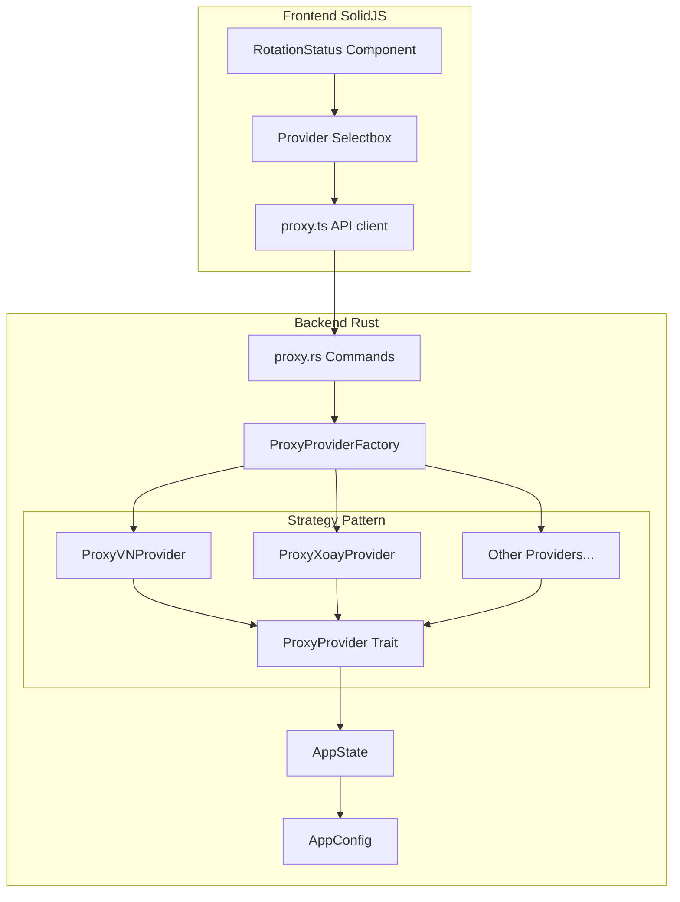

# Kiến trúc Multi-Provider Proxy Rotation

## Tóm tắt

Tài liệu này mô tả kiến trúc refactor để hỗ trợ nhiều nhà cung cấp proxy rotation sử dụng **Strategy Pattern** và **Factory Method**. Hiện tại, hệ thống chỉ hỗ trợ `proxy.vn` (proxyxoay.shop) với logic hardcoded trong [`RotationProxyProvider`](src-tauri/src/proxy/mod.rs:35).

## Vấn đề hiện tại

### 1. Logic Hardcoded
- [`parse_rotation_url()`](src-tauri/src/proxy/mod.rs:410) chỉ xử lý URL format của proxyxoay.shop
- [`RotationProxyResponse`](src-tauri/src/types/proxy.rs:23) chỉ phù hợp với response format của proxy.vn
- [`parse_ttl_from_message()`](src-tauri/src/proxy/mod.rs:479) parse tiếng Việt cụ thể

### 2. Thiếu Extensibility
- Không thể thêm provider mới mà không sửa đổi code hiện có
- Vi phạm nguyên tắc Open/Closed

## Kiến trúc đề xuất

### Overview



## 1. Backend Design (Rust)

### 1.1 Trait Definition - Strategy Pattern

File: `src-tauri/src/proxy/trait.rs`

```rust
use async_trait::async_trait;
use crate::types::proxy::{CachedProxy, ProviderConfig, RotationStatus};

/// Trait định nghĩa interface chung cho tất cả proxy providers
/// Implement nguyên tắc Strategy Pattern
#[async_trait]
pub trait ProxyProvider: Send + Sync {
    /// Unique identifier cho provider (vd: "proxy_vn", "proxy_xoay")
    fn provider_id(&self) -> &'static str;

    /// Human-readable name cho UI
    fn provider_name(&self) -> String;

    /// Kiểm tra xem provider có thể xử lý URL này không
    fn can_handle(&self, url: &str) -> bool;

    /// Tạo instance từ rotation URL
    fn from_url(url: &str) -> Result<Self, String> where Self: Sized;

    /// Fetch proxy mới từ provider API
    async fn fetch_proxy(&self) -> Result<CachedProxy, String>;

    /// Get cached proxy hoặc fetch mới nếu expired
    async fn get_or_refresh(&self) -> Result<CachedProxy, String>;

    /// Force rotate proxy (xóa cache và fetch mới)
    async fn force_rotate(&self) -> Result<CachedProxy, String>;

    /// Get current cached proxy without fetching
    async fn get_cached(&self) -> Option<CachedProxy>;

    /// Check if proxy is about to expire
    async fn is_about_to_expire(&self, threshold_seconds: u64) -> bool;

    /// Get valid proxy with auto-rotation
    async fn get_valid_proxy(&self, threshold_seconds: u64) -> Result<CachedProxy, String>;

    /// Get rotation status for frontend
    async fn get_status(&self) -> RotationStatus;

    /// Resolve cached proxy to standard proxy URL
    fn resolve_proxy_url(cached: &CachedProxy) -> Option<String> where Self: Sized;
}

/// Type alias cho dynamic dispatch
pub type DynProxyProvider = Arc<dyn ProxyProvider>;
```

### 1.2 Base Implementation

File: `src-tauri/src/proxy/base.rs`

```rust
use std::sync::Arc;
use std::time::{Duration, Instant};
use tokio::sync::RwLock;
use log::{debug, error, info, warn};
use crate::types::proxy::CachedProxy;

/// Base struct chứa common caching logic
/// Các concrete provider sẽ embed hoặc wrap struct này
#[derive(Debug)]
pub struct ProxyProviderBase {
    pub cache: Arc<RwLock<Option<CachedProxy>>>,
    pub client: reqwest::Client,
}

impl ProxyProviderBase {
    pub fn new() -> Result<Self, String> {
        let client = reqwest::Client::builder()
            .timeout(Duration::from_secs(30))
            .build()
            .map_err(|e| format!("Failed to create HTTP client: {}", e))?;

        Ok(Self {
            cache: Arc::new(RwLock::new(None)),
            client,
        })
    }

    /// Common double-checked caching logic
    pub async fn get_or_refresh_impl<F, Fut>(
        &self,
        fetch_fn: F,
    ) -> Result<CachedProxy, String>
    where
        F: FnOnce() -> Fut,
        Fut: std::future::Future<Output = Result<CachedProxy, String>>,
    {
        // First check with read lock
        {
            let cache = self.cache.read().await;
            if let Some(ref cached) = *cache {
                if !cached.is_expired() {
                    return Ok(cached.clone());
                }
            }
        }

        // Acquire write lock và double-check
        let mut cache = self.cache.write().await;
        if let Some(ref cached) = *cache {
            if !cached.is_expired() {
                return Ok(cached.clone());
            }
        }

        // Fetch new proxy
        let new_proxy = fetch_fn().await?;
        *cache = Some(new_proxy.clone());
        Ok(new_proxy)
    }

    pub async fn get_cached(&self) -> Option<CachedProxy> {
        let cache = self.cache.read().await;
        cache.clone()
    }

    pub async fn is_about_to_expire(&self, threshold_seconds: u64) -> bool {
        let cache = self.cache.read().await;
        if let Some(ref cached) = *cache {
            cached.expires_in_seconds() <= threshold_seconds
        } else {
            true
        }
    }
}
```

### 1.3 Concrete Provider - ProxyVN

File: `src-tauri/src/providers/proxy_vn.rs`

```rust
use async_trait::async_trait;
use crate::proxy::{ProxyProvider, ProxyProviderBase};
use crate::types::proxy::{CachedProxy, RotationConfig, RotationStatus};
use regex::Regex;
use std::time::{Duration, Instant};
use log::{debug, error, info};

/// Provider cho proxy.vn / proxyxoay.shop
#[derive(Debug)]
pub struct ProxyVNProvider {
    base: ProxyProviderBase,
    config: RotationConfig,
}

impl ProxyVNProvider {
    /// Parse rotation:// URL
    fn parse_url(url: &str) -> Result<RotationConfig, String> {
        if !url.starts_with("rotation://") {
            return Err("Invalid URL scheme".into());
        }

        let parsed = url::Url::parse(url)
            .map_err(|e| format!("Failed to parse URL: {}", e))?;

        let host = parsed.host_str()
            .ok_or("Missing host")?;

        let query_pairs: std::collections::HashMap<_, _> =
            parsed.query_pairs()
                .map(|(k, v)| (k.to_string(), v.to_string()))
                .collect();

        let api_key = query_pairs.get("key")
            .ok_or("Missing 'key' parameter")?
            .clone();

        let nhamang = query_pairs.get("nhamang")
            .cloned()
            .unwrap_or_else(|| "random".to_string());

        let tinhthanh = query_pairs.get("tinhthanh")
            .cloned()
            .unwrap_or_else(|| "0".to_string());

        // Build API URL theo format proxy.vn
        let api_url = format!(
            "https://{}/api/get.php?key={}&nhamang={}&tinhthanh={}",
            host, api_key, nhamang, tinhthanh
        );

        Ok(RotationConfig {
            api_url,
            api_key,
            nhamang,
            tinhthanh,
        })
    }

    /// Parse TTL từ message tiếng Việt
    fn parse_ttl(message: &str) -> u64 {
        let re = Regex::new(r"(?i)(\d+)\s*(?:s|giây|giay|seconds?|sec)").unwrap();
        if let Some(captures) = re.captures(message) {
            if let Some(seconds_str) = captures.get(1) {
                if let Ok(seconds) = seconds_str.as_str().parse::<u64>() {
                    return seconds;
                }
            }
        }
        1800 // Default 30 minutes
    }

    fn is_success_status(status: &serde_json::Value) -> bool {
        match status {
            serde_json::Value::String(s) => {
                let normalized = s.trim().to_ascii_lowercase();
                normalized == "success" || normalized == "ok" || normalized == "100"
            }
            serde_json::Value::Number(n) => {
                n.as_i64() == Some(100) || n.as_u64() == Some(100)
            }
            _ => false,
        }
    }

    fn is_waiting_status(status: &serde_json::Value) -> bool {
        match status {
            serde_json::Value::String(s) => {
                let normalized = s.trim().to_ascii_lowercase();
                normalized == "101" || normalized.contains("wait")
            }
            serde_json::Value::Number(n) => {
                n.as_i64() == Some(101) || n.as_u64() == Some(101)
            }
            _ => false,
        }
    }
}

#[async_trait]
impl ProxyProvider for ProxyVNProvider {
    fn provider_id(&self) -> &'static str {
        "proxy_vn"
    }

    fn provider_name(&self) -> String {
        "Proxy.vn / ProxyXoay".to_string()
    }

    fn can_handle(&self, url: &str) -> bool {
        url.starts_with("rotation://")
            && (url.contains("proxyxoay.shop") || url.contains("proxy.vn"))
    }

    fn from_url(url: &str) -> Result<Self, String> {
        let config = Self::parse_url(url)?;
        let base = ProxyProviderBase::new()?;

        Ok(Self { base, config })
    }

    async fn fetch_proxy(&self) -> Result<CachedProxy, String> {
        // Implementation giống current fetch_proxy_once
        // với retry logic và parsing response từ proxy.vn
        todo!("Implement fetch logic specific to proxy.vn API")
    }

    async fn get_or_refresh(&self) -> Result<CachedProxy, String> {
        self.base.get_or_refresh_impl(|| self.fetch_proxy()).await
    }

    async fn force_rotate(&self) -> Result<CachedProxy, String> {
        {
            let mut cache = self.base.cache.write().await;
            *cache = None;
        }
        self.get_or_refresh().await
    }

    async fn get_cached(&self) -> Option<CachedProxy> {
        self.base.get_cached().await
    }

    async fn is_about_to_expire(&self, threshold_seconds: u64) -> bool {
        self.base.is_about_to_expire(threshold_seconds).await
    }

    async fn get_valid_proxy(&self, threshold_seconds: u64) -> Result<CachedProxy, String> {
        // Implementation tương tự current get_valid_proxy
        todo!("Implement with auto-rotation logic")
    }

    async fn get_status(&self) -> RotationStatus {
        if let Some(cached) = self.get_cached().await {
            RotationStatus {
                active: true,
                current_proxy: Self::resolve_proxy_url(&cached).unwrap_or_default(),
                real_ip: cached.real_ip.clone(),
                expires_in_seconds: cached.expires_in_seconds(),
                ttl_seconds: cached.ttl_seconds,
            }
        } else {
            RotationStatus::default()
        }
    }

    fn resolve_proxy_url(cached: &CachedProxy) -> Option<String> {
        // Prefer SOCKS5
        if !cached.socks5_proxy.is_empty() && cached.socks5_proxy != ":" {
            return Self::parse_proxy_string(&cached.socks5_proxy, "socks5");
        }
        if !cached.http_proxy.is_empty() && cached.http_proxy != ":" {
            return Self::parse_proxy_string(&cached.http_proxy, "http");
        }
        None
    }
}
```

### 1.4 Factory Pattern

File: `src-tauri/src/proxy/factory.rs`

```rust
use crate::proxy::{DynProxyProvider, ProxyProvider};
use crate::providers::proxy_vn::ProxyVNProvider;
// use crate::providers::proxy_xoay::ProxyXoayProvider;
// use crate::providers::other_provider::OtherProvider;
use std::collections::HashMap;
use lazy_static::lazy_static;

/// Registry của các available providers
lazy_static! {
    static ref PROVIDER_REGISTRY: HashMap<&'static str, ProviderEntry> = {
        let mut m = HashMap::new();
        m.insert("proxy_vn", ProviderEntry {
            id: "proxy_vn",
            name: "Proxy.vn / ProxyXoay",
            factory: |url| ProxyVNProvider::from_url(url).map(|p| Arc::new(p) as DynProxyProvider),
        });
        // Thêm providers khác ở đây
        // m.insert("proxy_xoay", ProviderEntry { ... });
        m
    };
}

struct ProviderEntry {
    id: &'static str,
    name: &'static str,
    factory: fn(&str) -> Result<DynProxyProvider, String>,
}

/// Factory để tạo proxy provider từ URL
pub struct ProxyProviderFactory;

impl ProxyProviderFactory {
    /// Tạo provider từ rotation URL
    /// Tự động detect provider type dựa trên URL
    pub fn create(url: &str) -> Result<DynProxyProvider, String> {
        // Try auto-detect based on URL patterns
        if url.contains("proxyxoay.shop") || url.contains("proxy.vn") {
            return (PROVIDER_REGISTRY.get("proxy_vn").unwrap().factory)(url);
        }

        // Fallback: try all registered providers
        for (_, entry) in PROVIDER_REGISTRY.iter() {
            if let Ok(provider) = (entry.factory)(url) {
                return Ok(provider);
            }
        }

        Err(format!("No provider found for URL: {}", url))
    }

    /// Tạo provider cụ thể bằng ID
    pub fn create_by_id(provider_id: &str, url: &str) -> Result<DynProxyProvider, String> {
        PROVIDER_REGISTRY
            .get(provider_id)
            .ok_or_else(|| format!("Unknown provider: {}", provider_id))
            .and_then(|entry| (entry.factory)(url))
    }

    /// Lấy danh sách available providers (cho UI)
    pub fn available_providers() -> Vec<ProviderInfo> {
        PROVIDER_REGISTRY
            .values()
            .map(|entry| ProviderInfo {
                id: entry.id.to_string(),
                name: entry.name.to_string(),
            })
            .collect()
    }
}

/// Thông tin provider cho UI
#[derive(Debug, Clone, serde::Serialize)]
pub struct ProviderInfo {
    pub id: String,
    pub name: String,
}
```

### 1.5 Updated Data Models

File: `src-tauri/src/types/proxy.rs` (modifications)

```rust
// Thêm vào existing types/proxy.rs

/// Configuration cho rotation proxy settings
#[derive(Debug, Clone, Serialize, Deserialize)]
#[serde(rename_all = "camelCase")]
pub struct RotationProxySettings {
    /// Provider được chọn (vd: "proxy_vn", "proxy_xoay")
    pub provider_id: String,
    /// API key cho provider
    pub api_key: String,
    /// Network type (provider-specific)
    pub network_type: String,
    /// Province/city filter (provider-specific)
    pub location_filter: String,
    /// Custom API URL (optional, cho self-hosted hoặc custom endpoints)
    pub custom_api_url: Option<String>,
}

impl Default for RotationProxySettings {
    fn default() -> Self {
        Self {
            provider_id: "proxy_vn".to_string(),
            api_key: String::new(),
            network_type: "random".to_string(),
            location_filter: "0".to_string(),
            custom_api_url: None,
        }
    }
}

/// Provider metadata cho frontend
#[derive(Debug, Clone, Serialize, Deserialize)]
pub struct ProviderMetadata {
    pub id: String,
    pub name: String,
    /// Các fields cần thiết cho provider này
    pub required_fields: Vec<String>,
    /// Các options cho network type (nếu có)
    pub network_options: Vec<NetworkOption>,
    /// Các options cho location filter (nếu có)
    pub location_options: Vec<LocationOption>,
}

#[derive(Debug, Clone, Serialize, Deserialize)]
pub struct NetworkOption {
    pub value: String,
    pub label: String,
}

#[derive(Debug, Clone, Serialize, Deserialize)]
pub struct LocationOption {
    pub value: String,
    pub label: String,
}

/// Update RotationStatus để bao gồm provider info
#[derive(Debug, Clone, Serialize, Deserialize)]
#[serde(rename_all = "camelCase")]
pub struct RotationStatus {
    pub active: bool,
    pub provider_id: Option<String>,
    pub provider_name: Option<String>,
    pub current_proxy: String,
    pub real_ip: String,
    pub expires_in_seconds: u64,
    pub ttl_seconds: u64,
}
```

### 1.6 AppConfig Update

File: `src-tauri/src/config.rs` (modifications)

```rust
#[derive(Debug, Clone, Serialize, Deserialize)]
#[serde(rename_all = "camelCase")]
pub struct AppConfig {
    // ... existing fields ...

    /// Legacy: direct rotation URL (deprecated, use rotation_settings)
    #[serde(default)]
    pub proxy_url: String,

    /// New: structured rotation settings
    #[serde(default)]
    pub rotation_settings: Option<RotationProxySettings>,

    /// Selected provider ID (for UI state)
    #[serde(default)]
    pub rotation_provider_id: String,
}

impl Default for AppConfig {
    fn default() -> Self {
        Self {
            // ... existing defaults ...
            proxy_url: String::new(),
            rotation_settings: None,
            rotation_provider_id: "proxy_vn".to_string(),
            // ...
        }
    }
}
```

### 1.7 State Update

File: `src-tauri/src/state.rs` (modifications)

```rust
use crate::proxy::DynProxyProvider;

pub struct AppState {
    // ... existing fields ...

    /// Rotation proxy provider (dynamic trait object)
    pub rotation_provider: Mutex<Option<DynProxyProvider>>,

    /// TTL monitor cancellation flag
    pub ttl_monitor_running: Arc<AtomicBool>,
}
```

### 1.8 New Tauri Commands

File: `src-tauri/src/commands/proxy.rs` (additions)

```rust
use crate::proxy::factory::ProxyProviderFactory;

/// Lấy danh sách available providers
#[tauri::command]
pub fn get_available_rotation_providers() -> Vec<ProviderInfo> {
    ProxyProviderFactory::available_providers()
}

/// Lấy metadata cho một provider
#[tauri::command]
pub fn get_provider_metadata(provider_id: String) -> Result<ProviderMetadata, String> {
    // Return provider-specific metadata (fields, options, etc.)
    todo!("Implement provider metadata retrieval")
}

/// Cập nhật rotation settings và khởi tạo provider mới
#[tauri::command]
pub async fn update_rotation_settings(
    state: State<'_, AppState>,
    settings: RotationProxySettings,
) -> Result<(), String> {
    // 1. Save settings to config
    {
        let mut config = state.config.lock().unwrap();
        config.rotation_settings = Some(settings.clone());
        config.rotation_provider_id = settings.provider_id.clone();
        // Build rotation URL from settings
        config.proxy_url = build_rotation_url(&settings)?;
    }

    // 2. Create new provider
    let rotation_url = build_rotation_url(&settings)?;
    let provider = ProxyProviderFactory::create_by_id(&settings.provider_id, &rotation_url)?;

    // 3. Update state
    {
        let mut rotation_provider = state.rotation_provider.lock().unwrap();
        *rotation_provider = Some(provider);
    }

    Ok(())
}

fn build_rotation_url(settings: &RotationProxySettings) -> Result<String, String> {
    // Build rotation:// URL từ settings
    // Format: rotation://proxyxoay.shop?key=XXX&nhamang=YYY&tinhthanh=ZZZ
    let host = match settings.provider_id.as_str() {
        "proxy_vn" => "proxyxoay.shop",
        _ => return Err(format!("Unknown provider: {}", settings.provider_id)),
    };

    Ok(format!(
        "rotation://{}?key={}&nhamang={}&tinhthanh={}",
        host, settings.api_key, settings.network_type, settings.location_filter
    ))
}
```

## 2. Frontend Design (SolidJS)

### 2.1 Updated Types

File: `src/lib/tauri/proxy.ts` (additions)

```typescript
export interface RotationProxySettings {
  providerId: string;
  apiKey: string;
  networkType: string;
  locationFilter: string;
  customApiUrl?: string;
}

export interface ProviderInfo {
  id: string;
  name: string;
}

export interface ProviderMetadata {
  id: string;
  name: string;
  requiredFields: string[];
  networkOptions: Array<{ value: string; label: string }>;
  locationOptions: Array<{ value: string; label: string }>;
}

export interface RotationStatus {
  active: boolean;
  providerId?: string;
  providerName?: string;
  currentProxy: string;
  realIp: string;
  expiresInSeconds: number;
  ttlSeconds: number;
}

// New API functions
export async function getAvailableProviders(): Promise<ProviderInfo[]> {
  return invoke("get_available_rotation_providers");
}

export async function getProviderMetadata(providerId: string): Promise<ProviderMetadata> {
  return invoke("get_provider_metadata", { providerId });
}

export async function updateRotationSettings(settings: RotationProxySettings): Promise<void> {
  return invoke("update_rotation_settings", { settings });
}
```

### 2.2 Provider Selector Component

File: `src/components/settings/ProviderSelector.tsx` (new)

```tsx
import { createEffect, createSignal, Show, For } from "solid-js";
import {
  getAvailableProviders,
  getProviderMetadata,
  type ProviderInfo,
  type ProviderMetadata,
  type RotationProxySettings,
} from "../../lib/tauri/proxy";

interface ProviderSelectorProps {
  value: RotationProxySettings;
  onChange: (settings: RotationProxySettings) => void;
}

export function ProviderSelector(props: ProviderSelectorProps) {
  const [providers, setProviders] = createSignal<ProviderInfo[]>([]);
  const [metadata, setMetadata] = createSignal<ProviderMetadata | null>(null);
  const [loading, setLoading] = createSignal(false);

  // Load available providers on mount
  createEffect(() => {
    void loadProviders();
  });

  // Load metadata when provider changes
  createEffect(() => {
    const providerId = props.value.providerId;
    if (providerId) {
      void loadMetadata(providerId);
    }
  });

  const loadProviders = async () => {
    try {
      const list = await getAvailableProviders();
      setProviders(list);
    } catch (e) {
      console.error("Failed to load providers:", e);
    }
  };

  const loadMetadata = async (providerId: string) => {
    setLoading(true);
    try {
      const meta = await getProviderMetadata(providerId);
      setMetadata(meta);
    } catch (e) {
      console.error("Failed to load metadata:", e);
    } finally {
      setLoading(false);
    }
  };

  const handleProviderChange = (providerId: string) => {
    props.onChange({
      ...props.value,
      providerId,
      networkType: "random", // Reset to default
      locationFilter: "0",
    });
  };

  return (
    <div class="space-y-4">
      {/* Provider Select */}
      <div>
        <label class="block text-sm font-medium text-gray-700 dark:text-gray-300 mb-1">
          Proxy Provider
        </label>
        <select
          value={props.value.providerId}
          onChange={(e) => handleProviderChange(e.currentTarget.value)}
          class="w-full px-3 py-2 border border-gray-300 dark:border-gray-600 rounded-md
                 bg-white dark:bg-gray-800 text-gray-900 dark:text-gray-100
                 focus:ring-2 focus:ring-blue-500 focus:border-blue-500"
        >
          <For each={providers()}>
            {(provider) => (
              <option value={provider.id}>{provider.name}</option>
            )}
          </For>
        </select>
      </div>

      {/* API Key */}
      <div>
        <label class="block text-sm font-medium text-gray-700 dark:text-gray-300 mb-1">
          API Key
        </label>
        <input
          type="password"
          value={props.value.apiKey}
          onInput={(e) =>
            props.onChange({ ...props.value, apiKey: e.currentTarget.value })
          }
          class="w-full px-3 py-2 border border-gray-300 dark:border-gray-600 rounded-md
                 bg-white dark:bg-gray-800 text-gray-900 dark:text-gray-100"
          placeholder="Enter your API key"
        />
      </div>

      {/* Network Type (if options available) */}
      <Show when={metadata()?.networkOptions.length}>
        <div>
          <label class="block text-sm font-medium text-gray-700 dark:text-gray-300 mb-1">
            Network Type
          </label>
          <select
            value={props.value.networkType}
            onChange={(e) =>
              props.onChange({ ...props.value, networkType: e.currentTarget.value })
            }
            class="w-full px-3 py-2 border border-gray-300 dark:border-gray-600 rounded-md
                   bg-white dark:bg-gray-800 text-gray-900 dark:text-gray-100"
          >
            <For each={metadata()?.networkOptions}>
              {(option) => (
                <option value={option.value}>{option.label}</option>
              )}
            </For>
          </select>
        </div>
      </Show>

      {/* Location Filter (if options available) */}
      <Show when={metadata()?.locationOptions.length}>
        <div>
          <label class="block text-sm font-medium text-gray-700 dark:text-gray-300 mb-1">
            Location
          </label>
          <select
            value={props.value.locationFilter}
            onChange={(e) =>
              props.onChange({ ...props.value, locationFilter: e.currentTarget.value })
            }
            class="w-full px-3 py-2 border border-gray-300 dark:border-gray-600 rounded-md
                   bg-white dark:bg-gray-800 text-gray-900 dark:text-gray-100"
          >
            <For each={metadata()?.locationOptions}>
              {(option) => (
                <option value={option.value}>{option.label}</option>
              )}
            </For>
          </select>
        </div>
      </Show>

      {/* Custom API URL (if supported) */}
      <Show when={metadata()?.requiredFields.includes("customApiUrl")}>
        <div>
          <label class="block text-sm font-medium text-gray-700 dark:text-gray-300 mb-1">
            Custom API URL (Optional)
          </label>
          <input
            type="url"
            value={props.value.customApiUrl || ""}
            onInput={(e) =>
              props.onChange({ ...props.value, customApiUrl: e.currentTarget.value })
            }
            class="w-full px-3 py-2 border border-gray-300 dark:border-gray-600 rounded-md
                   bg-white dark:bg-gray-800 text-gray-900 dark:text-gray-100"
            placeholder="https://custom-api.example.com"
          />
        </div>
      </Show>
    </div>
  );
}
```

## 3. Module Structure

```
src-tauri/src/
├── proxy/
│   ├── mod.rs           # Re-exports
│   ├── trait.rs         # ProxyProvider trait (Strategy)
│   ├── base.rs          # ProxyProviderBase (common caching)
│   └── factory.rs       # ProxyProviderFactory
├── providers/
│   ├── mod.rs
│   ├── proxy_vn.rs      # ProxyVNProvider implementation
│   ├── proxy_xoay.rs    # (Future) ProxyXoayProvider
│   └── ...              # (Future) Other providers
└── types/
    └── proxy.rs         # Updated type definitions

src/
├── lib/tauri/
│   └── proxy.ts         # Updated API client
└── components/settings/
    ├── ProviderSelector.tsx    # New provider select component
    └── RotationStatus.tsx      # Existing (needs update)
```

## 4. Migration Path

### Phase 1: Backend Refactor (No breaking changes)
1. Tạo `proxy/trait.rs` với `ProxyProvider` trait
2. Tạo `proxy/base.rs` với common caching logic
3. Tạo `providers/proxy_vn.rs` - move existing logic
4. Tạo `proxy/factory.rs` với Factory pattern
5. Update `AppState` để dùng `DynProxyProvider`
6. Test - existing `rotation://` URLs vẫn hoạt động

### Phase 2: Data Model Update
1. Add `RotationProxySettings` vào types
2. Update `AppConfig` với `rotation_settings`
3. Add migration: convert existing `proxy_url` → `rotation_settings`
4. Add new commands: `get_available_rotation_providers`, `update_rotation_settings`

### Phase 3: Frontend Update
1. Update `proxy.ts` types và API functions
2. Create `ProviderSelector` component
3. Update Settings page để sử dụng new component
4. Update `RotationStatus` để hiển thị `providerName`

### Phase 4: New Provider Support
1. Implement new provider (vd: `proxy_xoay.rs`)
2. Register trong `PROVIDER_REGISTRY`
3. Add provider-specific metadata
4. Update UI nếu cần

## 5. Benefits

| Nguyên tắc | Application |
|------------|-------------|
| **Single Responsibility** | Mỗi provider chỉ lo logic của mình |
| **Open/Closed** | Thêm provider mới mà không sửa code hiện có |
| **Liskov Substitution** | Tất cả providers implement cùng trait |
| **Interface Segregation** | Trait tách biệt, không ép providers implement methods không cần thiết |
| **Dependency Inversion** | Commands phụ thuộc vào trait, không phụ thuộc concrete implementations |

## 6. Appendix: Provider Format Examples

### Proxy.vn / ProxyXoay
```
URL: rotation://proxyxoay.shop?key=XXX&nhamang=random&tinhthanh=0
API: https://proxyxoay.shop/api/get.php?key=XXX&nhamang=random&tinhthanh=0
Response: {"status": 100, "message": "...", "proxyhttp": "...", "proxysocks5": "...", "ip": "..."}
```

### Future: Other Providers
```
ProxyXoayAPI: rotation://proxyxoay.net?token=XXX&region=us
ProxyCheap: rotation://proxycheap.com?key=XXX&country=us
Oxylabs: rotation://oxylabs.io?user=XXX&pass=YYY&country=us
```
